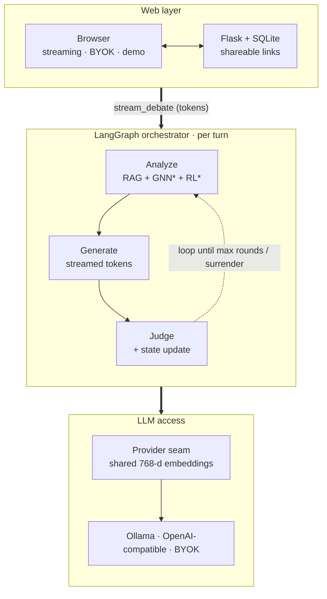

# Social Debate AI

<p align="center">
  <strong>A multi-agent LLM debate system — and an honest harness for measuring whether RAG, GNN and RL actually help</strong>
</p>

<p align="center">
  
  
  
  
</p>

---

## Overview

**Social Debate AI** is a multi-agent debate system where three LLM agents (support / oppose / neutral) argue a topic through a **LangGraph** turn loop. Around that working system it wires three trained ML modules behind clean seams — **RAG** (evidence retrieval), **GNN** (persuasion signal) and **RL** (strategy selection) — and an **ablation harness** that *measures* whether each one improves debate quality instead of assuming it does.

> **What this project is.** A **learning / portfolio / engineering-skeleton showcase** whose real subject is **measurement and diagnosis**, not "three cool modules integrated." The LLM drives almost all debate quality; the honest headline is what the ablation found. At this scale **RAG is the only module with a directional benefit and a clean mechanism**, while a naively stacked **GNN → RL pipeline fails for a diagnosable reason**: RL's reward is derived from a GNN that collapsed to the majority class, so the policy faithfully optimizes a mis-measured target — a worked example of the "no clean reward signal" trap. The deliverable is the skeleton + the harness that lets you *see* this, not a claim that all three modules work. See **[Architecture](docs/ARCHITECTURE.md)**, **[Design Decisions & Trade-offs](docs/DECISIONS.md)**, and the **[Ablation results](docs/eval_results.md)**.

### Key Features

| Feature | Description |
|---------|-------------|
| **Multi-Agent Debate** | 3 AI agents with unique stances (Support / Oppose / Neutral) engage in dynamic debates |
| **Token-Streaming UI** | Watch each agent's argument generate live via Server-Sent Events |
| **Bring-Your-Own-Key (BYOK)** | Users supply their own LLM key in the browser; the server never stores it |
| **Local-first LLM** | Defaults to a local/LAN **Ollama** (OpenAI-compatible) — no cloud key required |
| **Demo Mode** | One-click pre-recorded debate so visitors can try it with zero setup |
| **LangGraph Orchestration** | Declarative state-graph workflow with parallel analysis pipelines |
| **RAG Evidence Retrieval** | FAISS vector search over CMV evidence using Ollama `embeddinggemma` — the best-supported module: a directional gain on the metric it targets (evidence, **+0.039**) with a clean mechanism, though within judge noise at this sample size. See [eval](docs/eval_results.md) |
| **GNN Social Modeling** *(experimental)* | GraphSAGE+GAT persuasion model on real CMV conversation graphs. No measurable gain — and not cleanly testable: training collapsed to the majority class under class imbalance, so the persuasion signal is unreliable. Kept as a labeled diagnostic experiment. See [eval](docs/eval_results.md) |
| **RL Strategy Learning** *(experimental)* | PPO policy over 4 strategies. No measurable gain, and structurally couldn't win here: its reward is *derived from the (broken) GNN*, so it optimizes a mis-measured target. Kept as a diagnostic experiment — the failure is the lesson |
| **LLM-as-a-Judge Scoring** | Persuasion/attack/evidence scored by an LLM (keyword fallback) |

---

## Dataset

This project uses the **ChangeMyView (CMV) Corpus** from [Cornell ConvoKit](https://convokit.cornell.edu/documentation/changemyview.html) as training data.

| Attribute | Description |
|-----------|-------------|
| **Source** | [Cornell ConvoKit - ChangeMyView Corpus](https://convokit.cornell.edu/documentation/changemyview.html) |
| **Dataset Page** | [ConvoKit Datasets](https://convokit.cornell.edu/documentation/datasets.html) |
| **Origin** | Reddit r/changemyview subreddit |
| **Key Feature** | Contains "delta" (Δ) annotations marking successful persuasion |
| **Usage** | Training GNN persuasion prediction, RAG evidence retrieval, RL strategy learning |

> **Note**: The CMV dataset contains posts where users present their viewpoints and others attempt to change their minds. When someone's view is successfully changed, they award a "delta" (Δ) to the convincing argument.

---

## System Architecture



\* No module reaches significance at this sample size; RAG is the only one with a directional benefit and a clean mechanism, while GNN/RL are diagnostic experiments (the GNN→RL reward chain fails by construction) — see [eval_results](docs/eval_results.md).

---

## LangGraph Workflow

The debate is a declarative **StateGraph**. Each turn runs:
**parallel analysis** (RL + GNN + RAG) → **fuse** → **generate** (streamed token by
token) → **judge + state update** → **continue?** (loop until max rounds or a surrender).

### State Schema

| DebateState | AgentState |
|------------|------------|
| `topic` `current_round` `max_rounds` | `agent_id` `current_stance` |
| `agent_states` `history` | `conviction` `persuasion_history` |
| `rl_result` `gnn_result` `rag_result` | `attack_history` `has_surrendered` |

---

## Debate Strategies

The strategy selector chooses one of **4 strategies** per turn (trained PPO policy,
or a heuristic fallback):

| Strategy | Intent |
|----------|--------|
| Aggressive | Challenge and critique the opponent's argument |
| Defensive | Consolidate and protect the current position |
| Analytical | Lead with logic, data and evidence |
| Empathetic | Find common ground and connect |

---

## Quick Start

### Prerequisites

- **Python** 3.10+
- **RAM** 8GB+
- **An LLM backend** — one of:
  - **Ollama** (recommended, free, local/LAN) running an OpenAI-compatible API, with a chat model (e.g. `qwen3`, `gemma3`) and an embedding model (`embeddinggemma`). This is the default.
  - **or any OpenAI-compatible cloud key** (OpenAI, etc.) — supplied via `.env` or per-user in the browser (BYOK).
- **(optional) a GPU** — only to *train* the GNN/RL models; CPU works too. RTX 50-series/Blackwell needs CUDA 12.8 / PyTorch cu128. Not needed to run debates.

> No API key? Click **"Try demo (no key)"** in the UI to replay a pre-recorded debate.

### Installation (using uv - Recommended)

```bash
# 1. Clone the repository
git clone https://github.com/your-username/Social-Debate-AI.git
cd Social-Debate-AI

# 2. Install uv package manager
# Windows
powershell -c "irm https://astral.sh/uv/install.ps1 | iex"
# Linux/macOS
curl -LsSf https://astral.sh/uv/install.sh | sh

# 3. Create environment and install dependencies
uv sync

# 4. Configure environment
cp env.example .env
# Defaults to a local Ollama (no cloud key). To use a hosted model instead,
# set LLM_BASE_URL / LLM_API_KEY in .env (or let users supply their own via BYOK).
```

### Alternative: pip Installation

```bash
# Create virtual environment
python -m venv .venv
source .venv/bin/activate  # Linux/macOS
.venv\Scripts\activate     # Windows

# Install dependencies
pip install -r requirements.txt
```

### Run the Application

```bash
# Using uv
uv run python ui/app.py

# Or with activated venv
python ui/app.py
```

Open http://localhost:5000 to start debating!

---

## Reproduce (fork & run)

Everything is driven by a `Makefile` (or `scripts/reproduce.sh`). You need
Python 3.10+ and an LLM backend — point `.env` (`LLM_BASE_URL` / `LLM_API_KEY`)
at a local [Ollama](https://ollama.com) or any OpenAI-compatible endpoint.

```bash
make setup            # install deps + create .env from template
make reproduce        # deps -> RAG index (seed if no CMV) -> ablation. No GPU needed.
make run              # launch the web app

# Full pipeline (downloads the CMV corpus and trains GNN/RL; GPU recommended):
make reproduce-full   # = data + train + eval
```

Individual steps: `make data` (download/clean CMV), `make index` (build FAISS),
`make train` (GNN + PPO), `make eval` (ablation -> `docs/eval_results.md`),
`make test`, `make lint`, `make docker-app`, `make docker-train`.

No `make`? Use `bash scripts/reproduce.sh [full]`, or run the underlying
`python scripts/*.py` / `python train_all.py --all` commands directly.

Pre-trained models and the FAISS index are not in the repo (they live under
`data/`, which is gitignored). Get the full trained stack without retraining:

```bash
make models   # downloads models + FAISS index from the GitHub release into data/
```

Without them the app still runs with graceful fallbacks (GNN → neutral prior,
RL → keyword strategy, RAG → seed index). Or train from scratch with `make reproduce-full`.

---

## Project Structure

```
Social-Debate-AI/
├── src/
│   ├── llm/                # provider.py — the single LLM/embedding seam (Ollama/OpenAI/BYOK)
│   ├── orchestrator/       # langgraph_orchestrator.py, debate_state.py, debate_tools.py
│   ├── rag/                # vector_retriever.py (FAISS) + simple_retriever.py (fallback)
│   ├── gnn/                # social_encoder.py, train_graph.py, strategy_label.py
│   ├── rl/                 # policy_network.py, ppo_trainer.py, train_ppo.py
│   ├── storage/            # debate_store.py — SQLite persistence + shareable links
│   └── utils/              # config_loader.py
├── ui/                     # app.py (Flask), wsgi entry, templates/, static/
├── scripts/                # prepare_cmv.py, build_rag_index.py, eval_ab.py, make_demo.py
├── docker/                 # Dockerfile.app / Dockerfile.train + compose files
├── tests/                  # unit/ + integration/
├── configs/                # debate/rag/gnn/rl/system yaml
├── docs/                   # ARCHITECTURE, DECISIONS, eval_results, TRAINING, LEARNING_NOTE
├── wsgi.py  train_all.py  pyproject.toml  uv.lock
```

---

## Testing

```bash
# Run all tests
uv run pytest

# Verbose output
uv run pytest -v

# Run specific test file
uv run pytest tests/unit/test_debate_state.py

# Run with coverage report
uv run pytest --cov=src
```

---

## Configuration

### Environment Variables

Copy `env.example` to `.env` and adjust. Defaults target a local/LAN Ollama — no cloud key needed.

```bash
# LLM backend (default: local/LAN Ollama, OpenAI-compatible)
LLM_PROVIDER=ollama
LLM_MODEL=qwen3.6:latest
LLM_BASE_URL=http://localhost:11434/v1
LLM_API_KEY=ollama
LLM_EMBEDDING_MODEL=embeddinggemma:latest

# Let users supply their own key in the browser (recommended)
ALLOW_BYOK=true

# Use an LLM to score persuasion/attack/evidence (else keyword heuristic)
USE_LLM_JUDGE=true

# Flask
FLASK_DEBUG=false          # never enable in production

# To use a cloud model instead of Ollama:
# LLM_PROVIDER=openai
# LLM_MODEL=gpt-5.5
# LLM_BASE_URL=https://api.openai.com/v1
# LLM_API_KEY=sk-...
```

### Configuration Files

| File | Description |
|------|-------------|
| `configs/debate.yaml` | Debate rounds, timing, agent settings |
| `configs/rag.yaml` | Vector DB, embedding model, retrieval params |
| `configs/gnn.yaml` | Graph structure, hidden dimensions |
| `configs/rl.yaml` | PPO hyperparameters, reward design |
| `configs/system.yaml` | Global system settings |

---

## Model Training

```bash
# Train all models
uv run python train_all.py --all

# Train individual models
uv run python train_all.py --gnn    # GNN social encoder
uv run python train_all.py --rl     # RL policy network
uv run python train_all.py --rag    # Build RAG index
```

---

## Tech Stack

- **Orchestration:** LangGraph + LangChain
- **ML:** PyTorch, PyG (GNN), FAISS, embeddinggemma
- **LLM:** provider seam — Ollama / OpenAI-compatible / BYOK
- **Web:** Flask + gunicorn, Bootstrap 5, SQLite
- **Tooling:** uv, Docker, pytest, ruff

---

## Documentation

- [Architecture](docs/ARCHITECTURE.md) — system design, layers, data flow
- [Design Decisions & Trade-offs](docs/DECISIONS.md) — why, and honest limits
- [Ablation Results](docs/eval_results.md) — does each ML module actually help?
- [Training Guide](docs/guides/TRAINING.md) — CMV data pipeline + model training
- [Learning Notes](docs/LEARNING_NOTE.md) — study notes (GNN, PPO, RAG, LangGraph)

---

## Contributing

1. Fork the repository
2. Create your feature branch (`git checkout -b feature/AmazingFeature`)
3. Run tests (`uv run pytest`)
4. Commit your changes (`git commit -m 'Add AmazingFeature'`)
5. Push to the branch (`git push origin feature/AmazingFeature`)
6. Open a Pull Request

---

## License

This project is licensed under the **MIT License** — see the [LICENSE](LICENSE) file for details.
