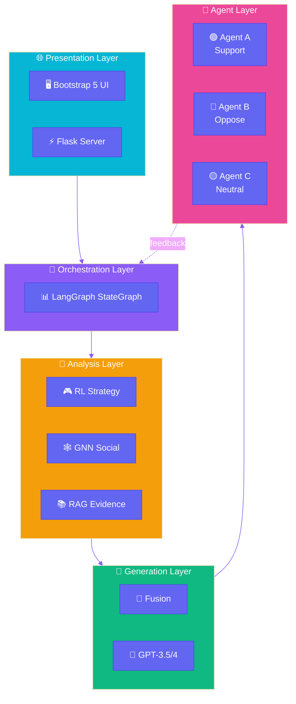
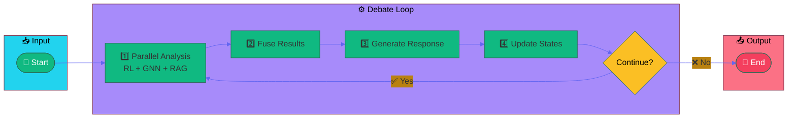
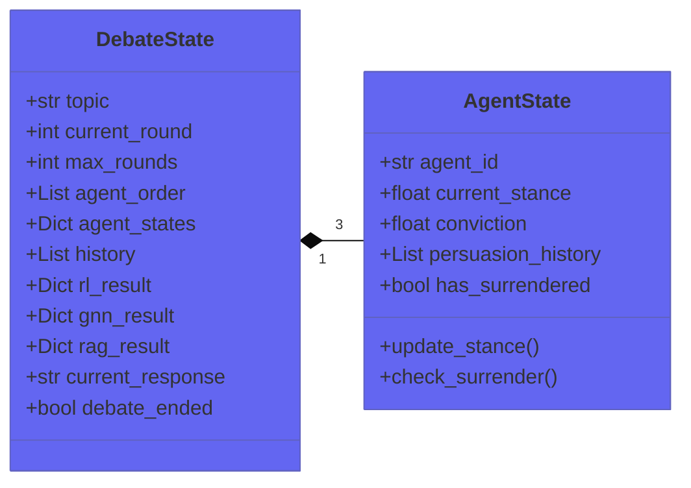
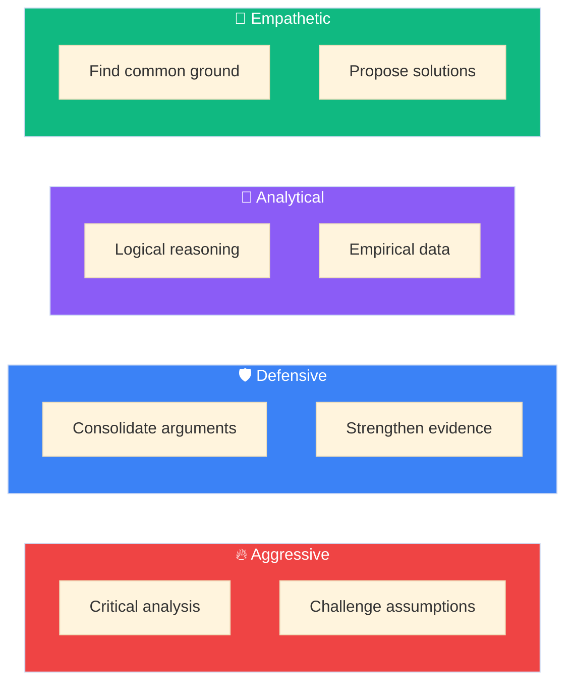
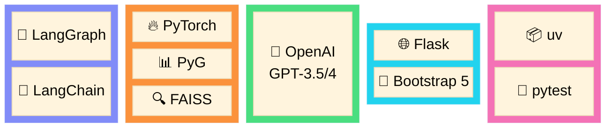
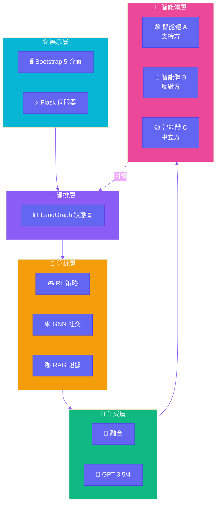
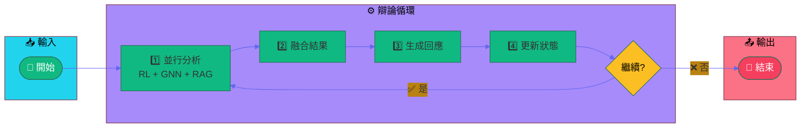

# 🎭 Social Debate AI

<p align="center">
  <strong>A Multi-Agent Debate System Powered by Deep Learning</strong>
</p>

<p align="center">
  <a href="#english-version">English</a> | <a href="#中文版本">中文</a>
</p>

<p align="center">
  
  
  
  
</p>

---

<a name="english-version"></a>

## 📖 Overview

**Social Debate AI** is an intelligent multi-agent debate simulation system that leverages cutting-edge deep learning technologies. It orchestrates dynamic debates between AI agents with distinct personalities and stances, using **LangGraph** for workflow management, **RAG** for evidence retrieval, **GNN** for social dynamics modeling, and **RL** for strategic decision-making.

### ✨ Key Features

| Feature | Description |
|---------|-------------|
| 🤖 **Multi-Agent Debate** | 3 AI agents with unique stances (Support / Oppose / Neutral) engage in dynamic debates |
| 🔄 **LangGraph Orchestration** | Declarative state-graph workflow with parallel analysis pipelines |
| 📚 **RAG Evidence Retrieval** | FAISS-powered vector search for relevant evidence and citations |
| 🕸️ **GNN Social Modeling** | Graph neural networks predict persuasion success and social influence |
| 🎮 **RL Strategy Learning** | PPO-based reinforcement learning with 4 adaptive debate strategies |
| 🌐 **Modern Web Interface** | Flask + Bootstrap 5 responsive UI for real-time debate visualization |

---

## 🏗️ System Architecture



---

## 🔄 LangGraph Workflow

The debate flow is managed by a declarative **StateGraph** that orchestrates the entire debate process:



### 📋 State Schema



---

## 🎮 Debate Strategies

The RL module selects from 4 adaptive strategies based on debate context:



---

## 🚀 Quick Start

### Prerequisites

- **Python** 3.10+
- **CUDA** 11.8+ (optional, for GPU acceleration)
- **RAM** 8GB+
- **OpenAI API Key**

### Installation (using uv - Recommended)

```bash
# 1. Clone the repository
git clone https://github.com/your-username/Social-Debate-AI.git
cd Social-Debate-AI

# 2. Install uv package manager
# Windows
powershell -c "irm https://astral.sh/uv/install.ps1 | iex"
# Linux/macOS
curl -LsSf https://astral.sh/uv/install.sh | sh

# 3. Create environment and install dependencies
uv sync

# 4. Configure environment
cp env.example .env
# Edit .env and add your OPENAI_API_KEY
```

### Alternative: pip Installation

```bash
# Create virtual environment
python -m venv .venv
source .venv/bin/activate  # Linux/macOS
.venv\Scripts\activate     # Windows

# Install dependencies
pip install -r requirements.txt
```

### Run the Application

```bash
# Using uv
uv run python ui/app.py

# Or with activated venv
python ui/app.py
```

🌐 Open http://localhost:5000 to start debating!

---

## 📁 Project Structure

```
Social-Debate-AI/
├── src/                          # Core source code
│   ├── agents/                   # Agent implementations
│   │   ├── base_agent.py        # Base agent class
│   │   ├── agent_a.py           # Support agent
│   │   ├── agent_b.py           # Oppose agent
│   │   └── agent_c.py           # Neutral agent
│   ├── orchestrator/            # LangGraph orchestration
│   │   ├── langgraph_orchestrator.py  # Main orchestrator
│   │   ├── debate_state.py      # State schema
│   │   └── debate_tools.py      # Tool wrappers
│   ├── rag/                     # Retrieval-Augmented Generation
│   │   ├── retriever.py         # Enhanced retriever
│   │   └── simple_retriever.py  # Lightweight retriever
│   ├── gnn/                     # Graph Neural Network
│   │   ├── social_encoder.py    # Social graph encoder
│   │   └── train_supervised.py  # Training script
│   ├── rl/                      # Reinforcement Learning
│   │   ├── policy_network.py    # PPO policy network
│   │   └── ppo_trainer.py       # PPO trainer
│   └── dialogue/                # Dialogue management
├── ui/                          # Web application
│   ├── app.py                   # Flask server
│   ├── static/                  # CSS & JavaScript
│   └── templates/               # HTML templates
├── tests/                       # Test suite
│   ├── unit/                    # Unit tests
│   └── integration/             # Integration tests
├── configs/                     # Configuration files
│   ├── debate.yaml              # Debate parameters
│   ├── rag.yaml                 # RAG settings
│   ├── gnn.yaml                 # GNN settings
│   └── rl.yaml                  # RL settings
├── docs/                        # Documentation
├── pyproject.toml               # Project configuration
└── uv.lock                      # Dependency lock file
```

---

## 🧪 Testing

```bash
# Run all tests
uv run pytest

# Verbose output
uv run pytest -v

# Run specific test file
uv run pytest tests/unit/test_debate_state.py

# Run with coverage report
uv run pytest --cov=src
```

---

## ⚙️ Configuration

### Environment Variables

```bash
# Required
OPENAI_API_KEY=sk-...

# Optional
USE_LANGGRAPH=true    # Enable LangGraph orchestrator (default: true)
```

### Configuration Files

| File | Description |
|------|-------------|
| `configs/debate.yaml` | Debate rounds, timing, agent settings |
| `configs/rag.yaml` | Vector DB, embedding model, retrieval params |
| `configs/gnn.yaml` | Graph structure, hidden dimensions |
| `configs/rl.yaml` | PPO hyperparameters, reward design |
| `configs/system.yaml` | Global system settings |

---

## 🏋️ Model Training

```bash
# Train all models
uv run python train_all.py --all

# Train individual models
uv run python train_all.py --gnn    # GNN social encoder
uv run python train_all.py --rl     # RL policy network
uv run python train_all.py --rag    # Build RAG index
```

---

## 🛠️ Tech Stack



---

## 📚 Documentation

### 📖 Core Learning Resource
- **[LEARNING_NOTE.md](docs/LEARNING_NOTE.md)** 📚 Comprehensive deep learning study notes (GNN, PPO, RAG, LangGraph)

### Architecture
- [System Overview](docs/architecture/OVERVIEW.md) - High-level architecture
- [LangGraph Orchestration](docs/architecture/LANGGRAPH.md) - Workflow engine
- [Data Flow](docs/architecture/DATA_FLOW.md) - State management

### Guides
- [Quick Start Guide](docs/guides/QUICKSTART.md) - Get running in 5 minutes
- [Configuration Guide](docs/guides/CONFIGURATION.md) - System configuration
- [Training Guide](docs/guides/TRAINING.md) - Model training
- [Deployment Guide](docs/guides/DEPLOYMENT.md) - Production deployment

### API & Modules
- [REST API Reference](docs/api/REST_API.md) - Flask API endpoints
- [RAG Module](docs/modules/RAG.md) - Evidence retrieval
- [GNN Module](docs/modules/GNN.md) - Social analysis
- [RL Module](docs/modules/RL.md) - Strategy selection
- [Scoring System](docs/modules/SCORING.md) - Victory determination

---

## 🤝 Contributing

1. Fork the repository
2. Create your feature branch (`git checkout -b feature/AmazingFeature`)
3. Run tests (`uv run pytest`)
4. Commit your changes (`git commit -m 'Add AmazingFeature'`)
5. Push to the branch (`git push origin feature/AmazingFeature`)
6. Open a Pull Request

---

## 📄 License

This project is licensed under the **MIT License** - see the [LICENSE](LICENSE) file for details.

---

<a name="中文版本"></a>

# 🎭 Social Debate AI

<p align="center">
  <strong>基於深度學習的多智能體辯論系統</strong>
</p>

<p align="center">
  <a href="#english-version">English</a> | <a href="#中文版本">中文</a>
</p>

---

## 📖 概述

**Social Debate AI** 是一個智能多智能體辯論模擬系統，結合尖端深度學習技術。系統編排具有不同個性和立場的 AI 智能體進行動態辯論，使用 **LangGraph** 進行工作流管理、**RAG** 進行證據檢索、**GNN** 進行社交動態建模，以及 **RL** 進行策略決策。

### ✨ 核心特色

| 特色 | 說明 |
|------|------|
| 🤖 **多智能體辯論** | 3 個具有獨特立場（支持/反對/中立）的 AI 智能體進行動態辯論 |
| 🔄 **LangGraph 編排** | 宣告式狀態圖工作流，支援並行分析管線 |
| 📚 **RAG 證據檢索** | 基於 FAISS 的向量搜索，檢索相關證據和引用 |
| 🕸️ **GNN 社交建模** | 圖神經網路預測說服成功率和社交影響力 |
| 🎮 **RL 策略學習** | 基於 PPO 的強化學習，4 種自適應辯論策略 |
| 🌐 **現代化 Web 介面** | Flask + Bootstrap 5 響應式 UI，即時辯論視覺化 |

---

## 🏗️ 系統架構



---

## 🔄 LangGraph 工作流程

辯論流程由宣告式 **StateGraph** 管理，編排整個辯論過程：



---

## 🎮 辯論策略

RL 模組根據辯論情境從 4 種自適應策略中選擇：

| 策略 | 說明 | 適用情境 |
|------|------|----------|
| 🔥 **激進策略** | 深入分析邏輯漏洞，挑戰核心假設 | 對手論點薄弱時 |
| 🛡️ **防守策略** | 鞏固核心論點，系統性回應挑戰 | 受到強烈攻擊時 |
| 🔬 **分析策略** | 使用邏輯推理、實證數據客觀評估 | 需要建立可信度時 |
| 💚 **同理策略** | 尋找共同點，理解對方合理關切 | 尋求共識時 |

---

## 🚀 快速開始

### 環境需求

- **Python** 3.10+
- **CUDA** 11.8+（可選，用於 GPU 加速）
- **RAM** 8GB+
- **OpenAI API Key**

### 安裝（使用 uv - 推薦）

```bash
# 1. 克隆儲存庫
git clone https://github.com/your-username/Social-Debate-AI.git
cd Social-Debate-AI

# 2. 安裝 uv 套件管理器
# Windows
powershell -c "irm https://astral.sh/uv/install.ps1 | iex"
# Linux/macOS
curl -LsSf https://astral.sh/uv/install.sh | sh

# 3. 創建環境並安裝依賴
uv sync

# 4. 設定環境變數
cp env.example .env
# 編輯 .env 並添加您的 OPENAI_API_KEY
```

### 替代方案：pip 安裝

```bash
# 創建虛擬環境
python -m venv .venv
source .venv/bin/activate  # Linux/macOS
.venv\Scripts\activate     # Windows

# 安裝依賴
pip install -r requirements.txt
```

### 運行應用程式

```bash
# 使用 uv
uv run python ui/app.py

# 或使用已啟動的虛擬環境
python ui/app.py
```

🌐 開啟 http://localhost:5000 開始辯論！

---

## 📁 專案結構

```
Social-Debate-AI/
├── src/                          # 核心源碼
│   ├── agents/                   # 智能體實現
│   ├── orchestrator/             # LangGraph 編排
│   ├── rag/                      # 檢索增強生成
│   ├── gnn/                      # 圖神經網路
│   ├── rl/                       # 強化學習
│   └── dialogue/                 # 對話管理
├── ui/                           # Web 應用程式
├── tests/                        # 測試套件
├── configs/                      # 配置文件
├── docs/                         # 文檔
├── pyproject.toml                # 專案配置
└── uv.lock                       # 依賴鎖定文件
```

---

## 🧪 測試

```bash
# 運行所有測試
uv run pytest

# 詳細輸出
uv run pytest -v

# 運行特定測試文件
uv run pytest tests/unit/test_debate_state.py

# 生成覆蓋率報告
uv run pytest --cov=src
```

---

## ⚙️ 配置

### 環境變數

```bash
# 必要
OPENAI_API_KEY=sk-...

# 可選
USE_LANGGRAPH=true    # 啟用 LangGraph 編排器（預設：true）
```

### 配置文件

| 文件 | 說明 |
|------|------|
| `configs/debate.yaml` | 辯論回合數、時間、智能體設定 |
| `configs/rag.yaml` | 向量資料庫、嵌入模型、檢索參數 |
| `configs/gnn.yaml` | 圖結構、隱藏層維度 |
| `configs/rl.yaml` | PPO 超參數、獎勵設計 |
| `configs/system.yaml` | 全域系統設定 |

---

## 🏋️ 模型訓練

```bash
# 訓練所有模型
uv run python train_all.py --all

# 訓練單個模型
uv run python train_all.py --gnn    # GNN 社交編碼器
uv run python train_all.py --rl     # RL 策略網路
uv run python train_all.py --rag    # 建立 RAG 索引
```

---

## 📚 文檔導覽

### 📖 核心學習資源
- **[LEARNING_NOTE.md](docs/LEARNING_NOTE.md)** 📚 完整深度學習筆記（GNN、PPO、RAG、LangGraph）

### 架構
- [系統概覽](docs/architecture/OVERVIEW.md) - 高層架構
- [LangGraph 編排](docs/architecture/LANGGRAPH.md) - 工作流引擎
- [資料流](docs/architecture/DATA_FLOW.md) - 狀態管理

### 指南
- [快速開始指南](docs/guides/QUICKSTART.md) - 5 分鐘啟動系統
- [配置指南](docs/guides/CONFIGURATION.md) - 系統配置
- [訓練指南](docs/guides/TRAINING.md) - 模型訓練
- [部署指南](docs/guides/DEPLOYMENT.md) - 生產部署

### API 與模組
- [REST API 參考](docs/api/REST_API.md) - Flask API 端點
- [RAG 模組](docs/modules/RAG.md) - 證據檢索
- [GNN 模組](docs/modules/GNN.md) - 社交分析
- [RL 模組](docs/modules/RL.md) - 策略選擇
- [評分系統](docs/modules/SCORING.md) - 勝負判定

---

## 🤝 貢獻

1. Fork 本儲存庫
2. 創建功能分支 (`git checkout -b feature/AmazingFeature`)
3. 運行測試 (`uv run pytest`)
4. 提交變更 (`git commit -m 'Add AmazingFeature'`)
5. 推送至分支 (`git push origin feature/AmazingFeature`)
6. 開啟 Pull Request

---

## 📄 授權

本專案採用 **MIT 授權** - 詳見 [LICENSE](LICENSE) 文件。

---

<p align="center">
  如果這個專案對您有幫助，請給我們一個 ⭐ Star！
</p>
