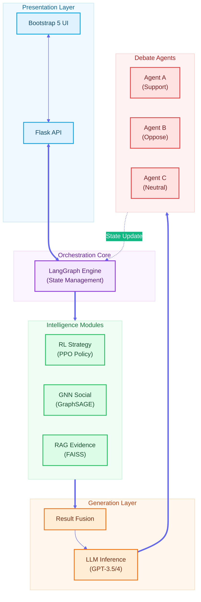
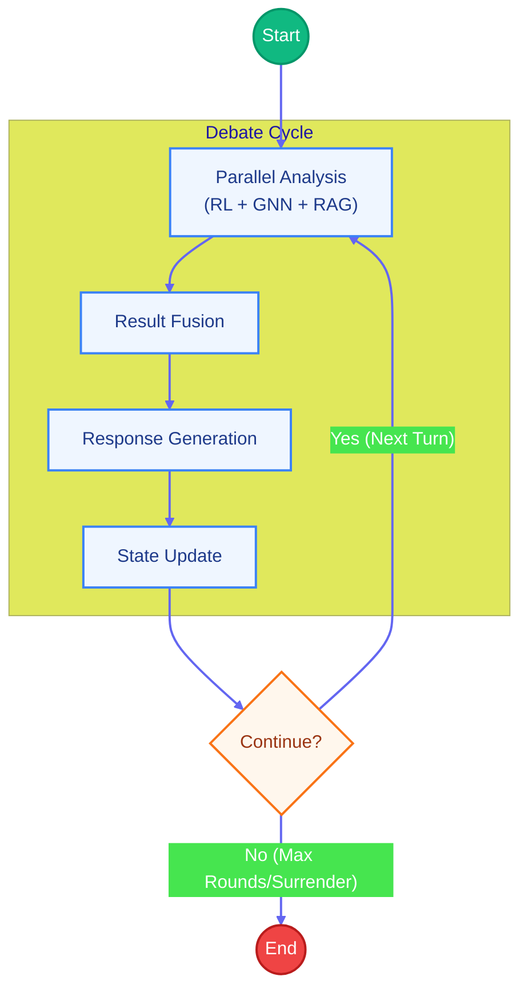
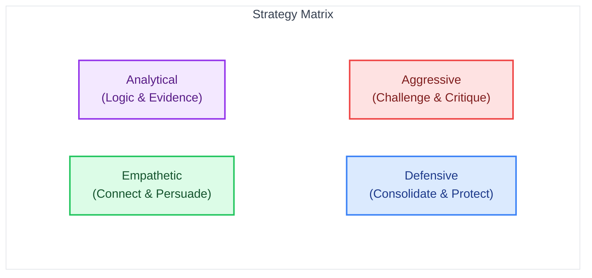
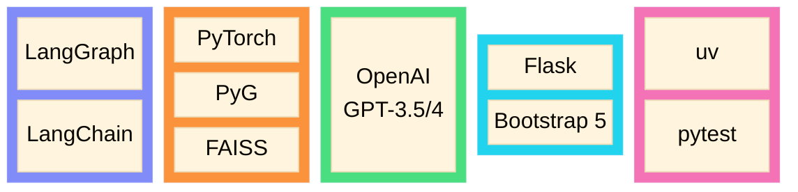
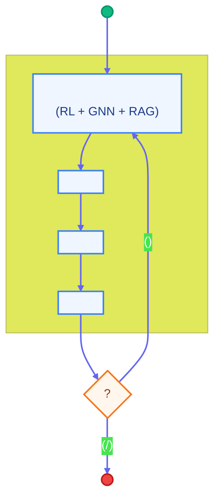
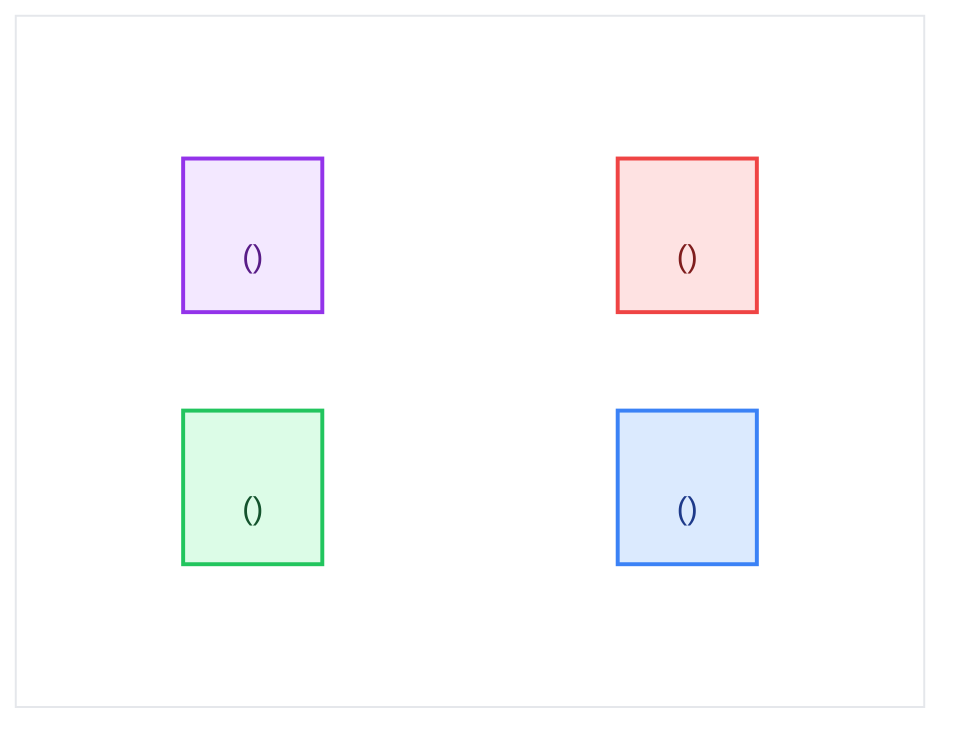

#  Social Debate AI

<p align="center">
  <strong>A Multi-Agent Debate System Powered by Deep Learning</strong>
</p>

<p align="center">
  <a href="#english-version">English</a> | <a href="#chinese-version">繁體中文</a>
</p>

<p align="center">
  
  
  
  
</p>

---

<a name="english-version"></a>

##  Overview

**Social Debate AI** is an intelligent multi-agent debate simulation system that leverages cutting-edge deep learning technologies. It orchestrates dynamic debates between AI agents with distinct personalities and stances, using **LangGraph** for workflow management, **RAG** for evidence retrieval, **GNN** for social dynamics modeling, and **RL** for strategic decision-making.

###  Key Features

| Feature | Description |
|---------|-------------|
|  **Multi-Agent Debate** | 3 AI agents with unique stances (Support / Oppose / Neutral) engage in dynamic debates |
|  **LangGraph Orchestration** | Declarative state-graph workflow with parallel analysis pipelines |
|  **RAG Evidence Retrieval** | FAISS-powered vector search for relevant evidence and citations |
|  **GNN Social Modeling** | Graph neural networks predict persuasion success and social influence |
|  **RL Strategy Learning** | PPO-based reinforcement learning with 4 adaptive debate strategies |
|  **Modern Web Interface** | Flask + Bootstrap 5 responsive UI for real-time debate visualization |

---

## Dataset

This project uses the **ChangeMyView (CMV) Corpus** from [Cornell ConvoKit](https://convokit.cornell.edu/documentation/changemyview.html) as training data.

| Attribute | Description |
|-----------|-------------|
| **Source** | [Cornell ConvoKit - ChangeMyView Corpus](https://convokit.cornell.edu/documentation/changemyview.html) |
| **Dataset Page** | [ConvoKit Datasets](https://convokit.cornell.edu/documentation/datasets.html) |
| **Origin** | Reddit r/changemyview subreddit |
| **Key Feature** | Contains "delta" (Δ) annotations marking successful persuasion |
| **Usage** | Training GNN persuasion prediction, RAG evidence retrieval, RL strategy learning |

> **Note**: The CMV dataset contains posts where users present their viewpoints and others attempt to change their minds. When someone's view is successfully changed, they award a "delta" (Δ) to the convincing argument.

---

##  System Architecture



---

##  LangGraph Workflow

The debate flow is managed by a declarative **StateGraph**:



###  State Schema

| DebateState | AgentState |
|------------|------------|
| `topic` `current_round` `max_rounds` | `agent_id` `current_stance` |
| `agent_states` `history` | `conviction` `persuasion_history` |
| `rl_result` `gnn_result` `rag_result` | `attack_history` `has_surrendered` |

---

##  Debate Strategies

The RL module selects from **4 adaptive strategies**:



---

##  Quick Start

### Prerequisites

- **Python** 3.10+
- **CUDA** 11.8+ (optional, for GPU acceleration)
- **RAM** 8GB+
- **OpenAI API Key**

### Installation (using uv - Recommended)

```bash
# 1. Clone the repository
git clone https://github.com/your-username/Social-Debate-AI.git
cd Social-Debate-AI

# 2. Install uv package manager
# Windows
powershell -c "irm https://astral.sh/uv/install.ps1 | iex"
# Linux/macOS
curl -LsSf https://astral.sh/uv/install.sh | sh

# 3. Create environment and install dependencies
uv sync

# 4. Configure environment
cp env.example .env
# Edit .env and add your OPENAI_API_KEY
```

### Alternative: pip Installation

```bash
# Create virtual environment
python -m venv .venv
source .venv/bin/activate  # Linux/macOS
.venv\Scripts\activate     # Windows

# Install dependencies
pip install -r requirements.txt
```

### Run the Application

```bash
# Using uv
uv run python ui/app.py

# Or with activated venv
python ui/app.py
```

 Open http://localhost:5000 to start debating!

---

##  Project Structure

```
Social-Debate-AI/
 src/                          # Core source code
    agents/                   # Agent implementations
       base_agent.py        # Base agent class
       agent_a.py           # Support agent
       agent_b.py           # Oppose agent
       agent_c.py           # Neutral agent
    orchestrator/            # LangGraph orchestration
       langgraph_orchestrator.py  # Main orchestrator
       debate_state.py      # State schema
       debate_tools.py      # Tool wrappers
    rag/                     # Retrieval-Augmented Generation
       retriever.py         # Enhanced retriever
       simple_retriever.py  # Lightweight retriever
    gnn/                     # Graph Neural Network
       social_encoder.py    # Social graph encoder
       train_supervised.py  # Training script
    rl/                      # Reinforcement Learning
       policy_network.py    # PPO policy network
       ppo_trainer.py       # PPO trainer
    dialogue/                # Dialogue management
 ui/                          # Web application
    app.py                   # Flask server
    static/                  # CSS & JavaScript
    templates/               # HTML templates
 tests/                       # Test suite
    unit/                    # Unit tests
    integration/             # Integration tests
 configs/                     # Configuration files
    debate.yaml              # Debate parameters
    rag.yaml                 # RAG settings
    gnn.yaml                 # GNN settings
    rl.yaml                  # RL settings
 docs/                        # Documentation
 pyproject.toml               # Project configuration
 uv.lock                      # Dependency lock file
```

---

##  Testing

```bash
# Run all tests
uv run pytest

# Verbose output
uv run pytest -v

# Run specific test file
uv run pytest tests/unit/test_debate_state.py

# Run with coverage report
uv run pytest --cov=src
```

---

##  Configuration

### Environment Variables

```bash
# Required
OPENAI_API_KEY=sk-...

# Optional
USE_LANGGRAPH=true    # Enable LangGraph orchestrator (default: true)
```

### Configuration Files

| File | Description |
|------|-------------|
| `configs/debate.yaml` | Debate rounds, timing, agent settings |
| `configs/rag.yaml` | Vector DB, embedding model, retrieval params |
| `configs/gnn.yaml` | Graph structure, hidden dimensions |
| `configs/rl.yaml` | PPO hyperparameters, reward design |
| `configs/system.yaml` | Global system settings |

---

##  Model Training

```bash
# Train all models
uv run python train_all.py --all

# Train individual models
uv run python train_all.py --gnn    # GNN social encoder
uv run python train_all.py --rl     # RL policy network
uv run python train_all.py --rag    # Build RAG index
```

---

##  Tech Stack



---

##  Documentation

###  Core Learning Resource
- **[LEARNING_NOTE.md](docs/LEARNING_NOTE.md)**  Comprehensive deep learning study notes (GNN, PPO, RAG, LangGraph)

### Architecture
- [System Overview](docs/architecture/OVERVIEW.md) - High-level architecture
- [LangGraph Orchestration](docs/architecture/LANGGRAPH.md) - Workflow engine
- [Data Flow](docs/architecture/DATA_FLOW.md) - State management

### Guides
- [Quick Start Guide](docs/guides/QUICKSTART.md) - Get running in 5 minutes
- [Configuration Guide](docs/guides/CONFIGURATION.md) - System configuration
- [Training Guide](docs/guides/TRAINING.md) - Model training
- [Deployment Guide](docs/guides/DEPLOYMENT.md) - Production deployment

### API & Modules
- [REST API Reference](docs/api/REST_API.md) - Flask API endpoints
- [RAG Module](docs/modules/RAG.md) - Evidence retrieval
- [GNN Module](docs/modules/GNN.md) - Social analysis
- [RL Module](docs/modules/RL.md) - Strategy selection
- [Scoring System](docs/modules/SCORING.md) - Victory determination

---

##  Contributing

1. Fork the repository
2. Create your feature branch (`git checkout -b feature/AmazingFeature`)
3. Run tests (`uv run pytest`)
4. Commit your changes (`git commit -m 'Add AmazingFeature'`)
5. Push to the branch (`git push origin feature/AmazingFeature`)
6. Open a Pull Request

---

##  License

This project is licensed under the **MIT License** - see the [LICENSE](LICENSE) file for details.

---

<a name="chinese-version"></a>

# Social Debate AI

<p align="center">
  <strong>深度學習驅動的多代理辯論系統</strong>
</p>

<p align="center">
  <a href="#english-version">English</a> | <a href="#chinese-version">繁體中文</a>
</p>

---

##  

**Social Debate AI**  AI  **LangGraph** **RAG** **GNN**  **RL** 

###  

|  |  |
|------|------|
|  **** | 3 // AI  |
|  **LangGraph ** |  |
|  **RAG ** |  FAISS  |
|  **GNN ** |  |
|  **RL ** |  PPO 4  |
|  ** Web ** | Flask + Bootstrap 5  UI |

---

## Dataset / 資料集

本專案使用 [Cornell ConvoKit](https://convokit.cornell.edu/documentation/changemyview.html) 的 **ChangeMyView (CMV) 語料庫**作為訓練資料。

| 屬性 | 說明 |
|------|------|
| **來源** | [Cornell ConvoKit - ChangeMyView Corpus](https://convokit.cornell.edu/documentation/changemyview.html) |
| **資料集頁面** | [ConvoKit Datasets](https://convokit.cornell.edu/documentation/datasets.html) |
| **原始來源** | Reddit r/changemyview 子版塊 |
| **核心特徵** | 包含標記成功說服的 "delta" 註解 |
| **用途** | 訓練 GNN 說服預測、RAG 證據檢索、RL 策略學習 |

> **說明**：CMV 資料集包含用戶發表觀點並由他人嘗試改變其想法的貼文。當某人的觀點被成功改變時，他們會授予說服者 "delta" 標記。

---

## 系統架構

```mermaid
%%{init: {'theme': 'base', 'themeVariables': { 'primaryColor': '#4f46e5', 'primaryTextColor': '#fff', 'primaryBorderColor': '#4338ca', 'lineColor': '#6366f1', 'secondaryColor': '#10b981', 'tertiaryColor': '#f59e0b'}}}%%
flowchart TB
    %% Nodes Configuration
    classDef web fill:#e0f2fe,stroke:#0ea5e9,stroke-width:2px,color:#0c4a6e;
    classDef orch fill:#f3e8ff,stroke:#9333ea,stroke-width:2px,color:#581c87;
    classDef brain fill:#dcfce7,stroke:#22c55e,stroke-width:2px,color:#14532d;
    classDef gen fill:#ffedd5,stroke:#f97316,stroke-width:2px,color:#7c2d12;
    classDef agent fill:#fee2e2,stroke:#ef4444,stroke-width:2px,color:#7f1d1d;

    subgraph Presentation[" "]
        direction TB
        UI[" Bootstrap 5 UI"]:::web
        API[" Flask API"]:::web
        UI <--> API
    end

    subgraph Core[" "]
        direction TB
        LG[" LangGraph <br/>()"]:::orch
    end

    subgraph Intelligence[" "]
        direction LR
        RL[" RL <br/>(PPO )"]:::brain
        GNN[" GNN <br/>(GraphSAGE)"]:::brain
        RAG[" RAG <br/>(FAISS)"]:::brain
    end

    subgraph Generation[" "]
        direction TB
        Fusion[" "]:::gen
        LLM[" LLM <br/>(GPT-3.5/4)"]:::gen
        Fusion --> LLM
    end

    subgraph Agents[" "]
        direction LR
        A1["  A<br/>()"]:::agent
        A2["  B<br/>()"]:::agent
        A3["  C<br/>()"]:::agent
    end

    %% Data Flow Connections
    API <==> LG
    LG ==> Intelligence
    Intelligence ==> Fusion
    LLM ==> Agents
    Agents -.->|""| LG

    %% Styling
    style Presentation fill:#f0f9ff,stroke:#bae6fd,color:#0369a1
    style Core fill:#faf5ff,stroke:#e9d5ff,color:#6b21a8
    style Intelligence fill:#f0fdf4,stroke:#bbf7d0,color:#15803d
    style Generation fill:#fff7ed,stroke:#fed7aa,color:#c2410c
    style Agents fill:#fef2f2,stroke:#fecaca,color:#b91c1c
```

---

##  LangGraph 

 **StateGraph** 



---

##  

RL  4 



---

##  

### 

- **Python** 3.10+
- **CUDA** 11.8+ GPU 
- **RAM** 8GB+
- **OpenAI API Key**

###  uv - 

```bash
# 1. 
git clone https://github.com/your-username/Social-Debate-AI.git
cd Social-Debate-AI

# 2.  uv 
# Windows
powershell -c "irm https://astral.sh/uv/install.ps1 | iex"
# Linux/macOS
curl -LsSf https://astral.sh/uv/install.sh | sh

# 3. 
uv sync

# 4. 
cp env.example .env
#  .env  OPENAI_API_KEY
```

### pip 

```bash
# 
python -m venv .venv
source .venv/bin/activate  # Linux/macOS
.venv\Scripts\activate     # Windows

# 
pip install -r requirements.txt
```

### 

```bash
#  uv
uv run python ui/app.py

# 
python ui/app.py
```

  http://localhost:5000 

---

##  

```
Social-Debate-AI/
 src/                          # 
    agents/                   # 
    orchestrator/             # LangGraph 
    rag/                      # 
    gnn/                      # 
    rl/                       # 
    dialogue/                 # 
 ui/                           # Web 
 tests/                        # 
 configs/                      # 
 docs/                         # 
 pyproject.toml                # 
 uv.lock                       # 
```

---

##  

```bash
# 
uv run pytest

# 
uv run pytest -v

# 
uv run pytest tests/unit/test_debate_state.py

# 
uv run pytest --cov=src
```

---

##  

### 

```bash
# 
OPENAI_API_KEY=sk-...

# 
USE_LANGGRAPH=true    #  LangGraph true
```

### 

|  |  |
|------|------|
| `configs/debate.yaml` |  |
| `configs/rag.yaml` |  |
| `configs/gnn.yaml` |  |
| `configs/rl.yaml` | PPO  |
| `configs/system.yaml` |  |

---

##  

```bash
# 
uv run python train_all.py --all

# 
uv run python train_all.py --gnn    # GNN 
uv run python train_all.py --rl     # RL 
uv run python train_all.py --rag    #  RAG 
```

---

##  


---

##  

###  
- **[LEARNING_NOTE.md](docs/LEARNING_NOTE.md)**  GNNPPORAGLangGraph

### 
- [](docs/architecture/OVERVIEW.md) - 
- [LangGraph ](docs/architecture/LANGGRAPH.md) - 
- [](docs/architecture/DATA_FLOW.md) - 

### 
- [](docs/guides/QUICKSTART.md) - 5 
- [](docs/guides/CONFIGURATION.md) - 
- [](docs/guides/TRAINING.md) - 
- [](docs/guides/DEPLOYMENT.md) - 

### API 
- [REST API ](docs/api/REST_API.md) - Flask API 
- [RAG ](docs/modules/RAG.md) - 
- [GNN ](docs/modules/GNN.md) - 
- [RL ](docs/modules/RL.md) - 
- [](docs/modules/SCORING.md) - 

---

##  

1. Fork 
2.  (`git checkout -b feature/AmazingFeature`)
3.  (`uv run pytest`)
4.  (`git commit -m 'Add AmazingFeature'`)
5.  (`git push origin feature/AmazingFeature`)
6.  Pull Request

---

##  

 **MIT ** -  [LICENSE](LICENSE) 

---

<p align="center">
    Star
</p>
