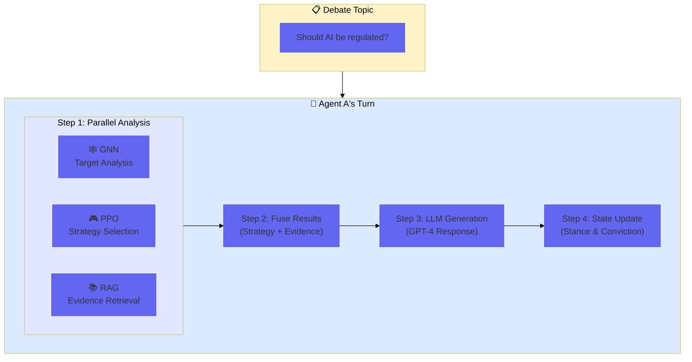
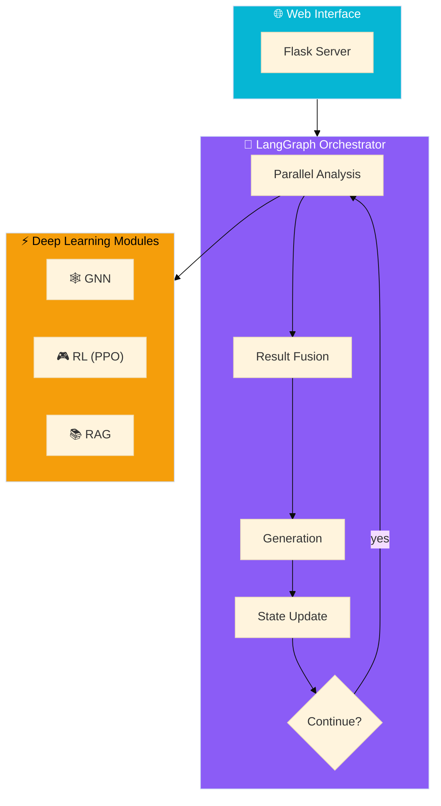
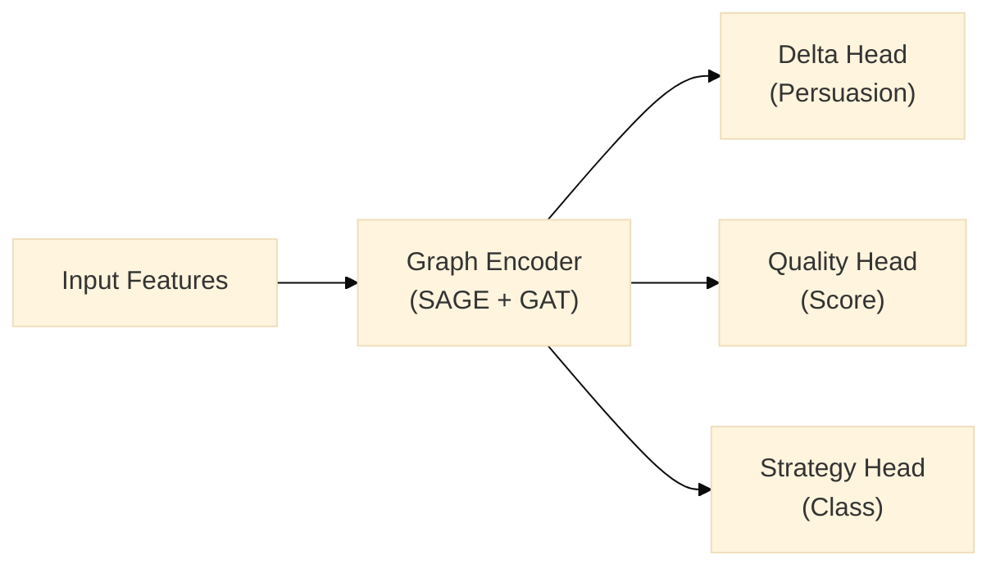
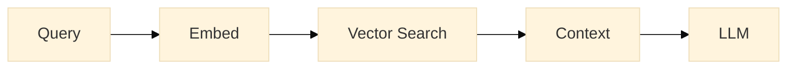

# 📚 Deep Learning Study Notes
## Social Debate AI - Multi-Agent Social Debate System

> **About this document**: A comprehensive learning notebook documenting the key concepts, architectures, and implementations of GNN, PPO, RAG, and LangGraph in the context of a multi-agent debate system.

---

# 📑 Table of Contents

## Part 1: Project Fundamentals
- [1.1 What is this project?](#11-what-is-this-project)
- [1.2 System Architecture Overview](#12-system-architecture-overview)
- [1.3 Code Structure](#13-code-structure)

## Part 2: GNN Deep Dive ⭐
- [2.1 What is Graph Neural Network?](#21-what-is-graph-neural-network)
- [2.2 GraphSAGE Explained](#22-graphsage-explained)
- [2.3 GAT (Graph Attention) Explained](#23-gat-graph-attention-explained)
- [2.4 Project GNN Architecture Analysis](#24-project-gnn-architecture-analysis)
- [2.5 GNN Training Pipeline](#25-gnn-training-pipeline)
- [2.6 GNN Inference Pipeline](#26-gnn-inference-pipeline)

## Part 3: PPO Deep Dive ⭐
- [3.1 Reinforcement Learning Fundamentals](#31-reinforcement-learning-fundamentals)
- [3.2 Policy Gradient Methods](#32-policy-gradient-methods)
- [3.3 PPO Core Principles](#33-ppo-core-principles)
- [3.4 Actor-Critic Architecture](#34-actor-critic-architecture)
- [3.5 GAE (Generalized Advantage Estimation)](#35-gae-generalized-advantage-estimation)
- [3.6 Project PPO Implementation Analysis](#36-project-ppo-implementation-analysis)

## Part 4: RAG & LangGraph
- [4.1 RAG Principles and Implementation](#41-rag-principles-and-implementation)
- [4.2 LangGraph State Machine](#42-langgraph-state-machine)

## Part 5: Reflections & Best Practices
- [5.1 Project Summary](#51-project-summary)
- [5.2 Key Technical Challenges](#52-key-technical-challenges)
- [5.3 Knowledge Checklist](#53-knowledge-checklist)

---

# Part 1: Project Fundamentals

## 1.1 What is this project?

### One-Sentence Summary
**Social Debate AI** is a multi-agent system where 3 AI agents debate each other using advanced deep learning techniques:
1.  **GNN** to analyze persuasion targets.
2.  **RL (PPO)** to select optimal strategies.
3.  **RAG** to retrieve supporting evidence.
4.  **GPT-4** to generate arguments.

### Visual Understanding



---

## 1.2 System Architecture Overview



---

## 1.3 Code Structure

```
Social-Debate-AI/
│
├── src/
│   ├── gnn/                      # 🧠 Graph Neural Network
│   │   ├── social_encoder.py     # GNN model definition
│   │   └── train_supervised.py   # Training script
│   │
│   ├── rl/                       # 🎮 Reinforcement Learning
│   │   ├── policy_network.py     # PPO Actor-Critic network
│   │   └── ppo_trainer.py        # PPO trainer & environment
│   │
│   ├── rag/                      # 🔍 Knowledge Retrieval
│   │   ├── retriever.py          # Enhanced retriever
│   │   └── simple_retriever.py   # Base retriever
│   │
│   └── orchestrator/             # 🎯 Orchestrator
│       ├── langgraph_orchestrator.py  # Workflow engine
│       ├── debate_state.py            # State schema
│       └── debate_tools.py            # Module wrappers
```

---

# Part 2: GNN Deep Dive ⭐

## 2.1 What is Graph Neural Network?

Unlike regular Neural Networks (MLP) that handle fixed-size vectors, **Graph Neural Networks (GNN)** process graph-structured data (Nodes + Edges).

In our debate system, the debate history forms a graph:
*   **Nodes**: Posts and replies.
*   **Edges**: Reply relationships.
*   **Features**: Text embeddings (DistilBERT).

**Goal**: Learn which arguments are persuasive and how influence propagates through the conversation structure.

---

## 2.2 GraphSAGE Explained

**GraphSAGE (SAmple and aggreGatE)** solves the scalability problem of traditional GCNs. Instead of using the entire graph matrix, it samples neighbors and aggregates their features.

**Key Steps:**
1.  **Sample**: Select a fixed number of neighbors for each node.
2.  **Aggregate**: Combine neighbor features (e.g., using mean or max).
3.  **Update**: Combine aggregated neighbor info with the node's current features.

### Code Correspondence (PyTorch Geometric)

```python
# src/gnn/social_encoder.py

self.conv1 = tgnn.SAGEConv(input_dim, hidden_dim)
# input_dim = 768 (BERT embedding)
# hidden_dim = 256
```

---

## 2.3 GAT (Graph Attention) Explained

**GAT (Graph Attention Network)** improves on GraphSAGE by assigning **learnable weights** to different neighbors. Not all replies are equally important!

**Mechanism:**
1.  Calculate **Attention Score** for every neighbor pair.
2.  Apply **Softmax** to normalize scores.
3.  Compute weighted sum of neighbor features.

**Multi-Head Attention**: We use `heads=4` to learn different types of relationships simultaneously.

```python
# src/gnn/social_encoder.py
self.attention = tgnn.GATConv(128, 128, heads=4, concat=False)
```

---

## 2.4 Project GNN Architecture Analysis

Our model is a **Multi-Task Learning** architecture:

1.  **Encoder**: 3 layers of GraphSAGE (compression) + 1 layer of GAT (attention).
2.  **Heads**:
    *   `delta_head`: Binary classification (Will this persuade? 0/1)
    *   `quality_head`: Regression (Quality score 0.0-1.0)
    *   `strategy_head`: Classification (Which strategy is this? 0-3)



---

## 2.5 GNN Training Pipeline

We use the **ChangeMyView (CMV)** dataset from Reddit.
*   **Input**: Text encoded by DistilBERT (`[768]`).
*   **Labels**: Delta (persuaded), score, strategy.
*   **Loss**: Weighted sum of BCE (delta), MSE (quality), and CrossEntropy (strategy).

---

## 2.6 GNN Inference Pipeline

**Critical Note**: Ensure the inference pipeline matches the training pipeline.
*   **Training**: Real text -> DistilBERT -> GNN.
*   **Inference**: Real debate context -> DistilBERT -> GNN.

*(Do not use random noise vectors for inference, as discussed in technical challenges.)*

---

# Part 3: PPO Deep Dive ⭐

## 3.1 Reinforcement Learning Fundamentals

*   **Agent**: The debater.
*   **Environment**: The debate simulation (other agents + judge).
*   **State**: 768-dim context vector.
*   **Action**: Select strategy (Aggressive, Defensive, Analytical, Empathetic).
*   **Reward**: Score change based on persuasion success.

---

## 3.2 Policy Gradient Methods

Policy Gradient directly optimizes the policy `π(a|s)` to maximize expected reward.
*   **Idea**: If an action leads to good reward, increase its probability.
*   **Problem**: High variance and unstable updates.

---

## 3.3 PPO Core Principles

**PPO (Proximal Policy Optimization)** stabilizes training by limiting how much the policy can change in a single step.

**Clipped Objective**:
It uses a ratio `r(θ) = π_new / π_old`. If `r(θ)` moves too far from 1 (e.g., > 1.2 or < 0.8), the update is clipped. This prevents the "policy collapse" problem common in standard RL.

---

## 3.4 Actor-Critic Architecture

Our PPO implementation uses an **Actor-Critic** network:
1.  **Actor (Policy)**: Outputs action probabilities (which strategy to use?).
2.  **Critic (Value)**: Estimates state value (how good is the current situation?).

Shared layers extract features, while separate heads output policy and value.

---

## 3.5 GAE (Generalized Advantage Estimation)

We use **GAE** to calculate "Advantage" (how much better an action was compared to the average).
*   Combines **TD-Error** (short-term) and **Monte-Carlo** (long-term) returns.
*   Controlled by parameter `lambda` (0.95).

---

## 3.6 Project PPO Implementation Analysis

### Network
```python
# src/rl/ppo_trainer.py
self.shared = nn.Linear(768, 256)
self.actor = nn.Linear(256, 4)  # 4 strategies
self.critic = nn.Linear(256, 1) # Value scalar
```

### Reward Design
Designing the reward function is crucial.
*   **Sparse Reward**: +1 only when opponent surrenders (hard to learn).
*   **Dense Reward**: +0.1 for every increase in opponent's persuasion score (better).

---

# Part 4: RAG & LangGraph

## 4.1 RAG Principles and Implementation

**RAG (Retrieval Augmented Generation)** bridges the gap between LLM's frozen knowledge and real-time facts.

**Process**:
1.  **Query**: "AI regulation cases".
2.  **Embed**: Convert to vector (OpenAI `text-embedding-3-small`).
3.  **Search**: Find nearest neighbors in FAISS database.
4.  **Generate**: Feed retrieved docs + query to GPT-4.



---

## 4.2 LangGraph State Machine

**LangGraph** allows us to define the debate flow as a graph.

*   **State**: `DebateState` (TypedDict) holds the conversation history.
*   **Nodes**: Python functions (`parallel_analysis`, `generate_response`).
*   **Edges**: Logic to transition (e.g., `should_continue`).

**Key Feature**: `Annotated[List[Dict], operator.add]`. This tells LangGraph to *append* new messages to the history list rather than overwriting it.

---

# Part 5: Reflections & Best Practices

## 5.1 Project Summary

This project integrates GNN, PPO, RAG, and LangGraph to create a sophisticated debate system. The key achievement is orchestrating these disparate AI modules into a coherent flow using state machines, allowing for dynamic and informed debate responses.

## 5.2 Key Technical Challenges

1.  **Training-Inference Skew**: Ensuring GNN/RL models receive the same feature distribution in production as during training is vital.
2.  **Reward Engineering**: In RL, "you get what you optimize for." Poorly designed rewards lead to gaming the system (e.g., repeating the same "optimal" phrase).
3.  **Async Concurrency**: Managing event loops when combining LangGraph (async) with PyTorch (blocking) requires careful thread management.

## 5.3 Knowledge Checklist

- [ ] GraphSAGE vs. GAT difference?
- [ ] Why PPO uses clipping?
- [ ] How RAG embedding search works?
- [ ] LangGraph state reducer (`operator.add`)?

---
*Last Updated: December 2024*
