# 📚 Deep Learning Study Notes
## Social Debate AI - Multi-Agent Social Debate System

> **About this document**: A comprehensive learning notebook documenting the key concepts, architectures, and implementations of GNN, PPO, RAG, and LangGraph in the context of a multi-agent debate system.

---

# 📑 Table of Contents

## Part 1: Project Fundamentals
- [1.1 What is this project?](#11-what-is-this-project)
- [1.2 System Architecture Overview](#12-system-architecture-overview)
- [1.3 Code Structure](#13-code-structure)

## Part 2: GNN Deep Dive ⭐
- [2.1 What is Graph Neural Network?](#21-what-is-graph-neural-network)
- [2.2 GraphSAGE Explained](#22-graphsage-explained)
- [2.3 GAT (Graph Attention) Explained](#23-gat-graph-attention-explained)
- [2.4 Project GNN Architecture Analysis](#24-project-gnn-architecture-analysis)
- [2.5 GNN Training Pipeline](#25-gnn-training-pipeline)
- [2.6 GNN Inference Pipeline](#26-gnn-inference-pipeline)

## Part 3: PPO Deep Dive ⭐
- [3.1 Reinforcement Learning Fundamentals](#31-reinforcement-learning-fundamentals)
- [3.2 Policy Gradient Methods](#32-policy-gradient-methods)
- [3.3 PPO Core Principles](#33-ppo-core-principles)
- [3.4 Actor-Critic Architecture](#34-actor-critic-architecture)
- [3.5 GAE (Generalized Advantage Estimation)](#35-gae-generalized-advantage-estimation)
- [3.6 Project PPO Implementation Analysis](#36-project-ppo-implementation-analysis)

## Part 4: RAG & LangGraph
- [4.1 RAG Principles and Implementation](#41-rag-principles-and-implementation)
- [4.2 LangGraph State Machine](#42-langgraph-state-machine)

## Part 5: Reflections & Best Practices
- [5.1 Project Summary](#51-project-summary)
- [5.2 Key Technical Challenges](#52-key-technical-challenges)
- [5.3 Knowledge Checklist](#53-knowledge-checklist)

---

# Part 1: Project Fundamentals

## 1.1 What is this project?

### One-Sentence Summary
> **Social Debate AI** = 3 AI agents debate with each other, where each AI:
> 1. Uses **GNN** to analyze "who is easier to persuade"
> 2. Uses **RL (PPO)** to select "aggressive/defensive/analytical/empathetic" strategy
> 3. Uses **RAG** to retrieve supporting evidence
> 4. Uses **GPT-4** to generate debate responses

### Visual Understanding

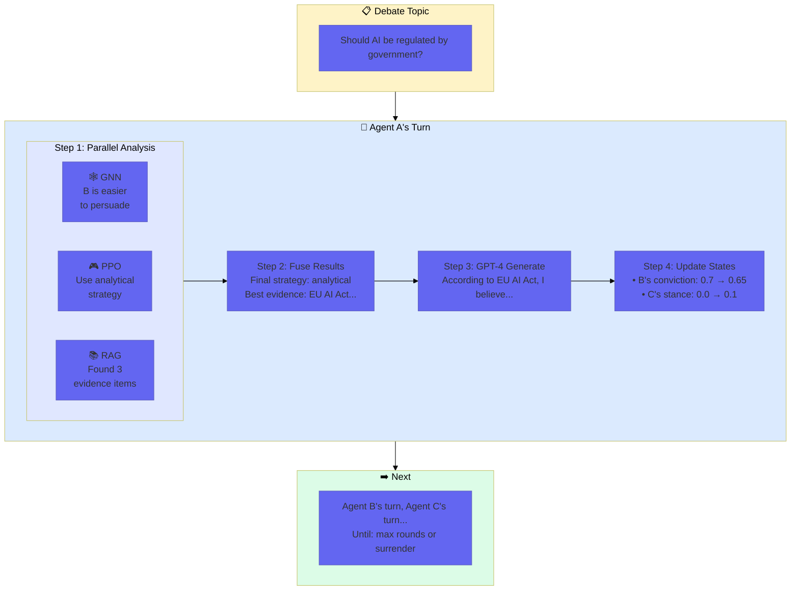

---

## 1.2 System Architecture Overview

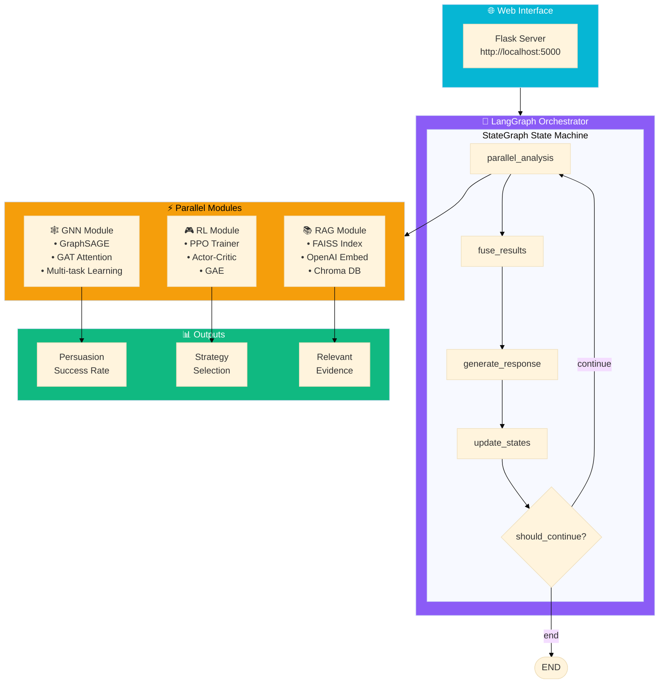

---

## 1.3 Code Structure

```
Social-Debate-AI/
│
├── src/
│   ├── gnn/                      # 🧠 Graph Neural Network
│   │   ├── social_encoder.py     # GNN model definition + inference
│   │   └── train_supervised.py   # GNN training script
│   │
│   ├── rl/                       # 🎮 Reinforcement Learning
│   │   ├── policy_network.py     # Policy network (for inference)
│   │   └── ppo_trainer.py        # PPO trainer
│   │
│   ├── rag/                      # 🔍 Knowledge Retrieval
│   │   ├── retriever.py          # Enhanced retriever
│   │   └── simple_retriever.py   # Simple retriever
│   │
│   └── orchestrator/             # 🎯 Orchestrator
│       ├── langgraph_orchestrator.py  # Main orchestrator
│       ├── debate_state.py            # State definition
│       └── debate_tools.py            # Tool wrappers
│
├── ui/                           # 🌐 Web Interface
│   └── app.py                    # Flask application
│
└── configs/                      # ⚙️ Configuration
    ├── gnn.yaml
    ├── rl.yaml
    └── ...
```

---

# Part 2: GNN Deep Dive ⭐

## 2.1 What is Graph Neural Network?

### From Regular Neural Networks

**Regular Neural Network (MLP)**:
- Input: Fixed-size vector `[x1, x2, x3, ...]`
- Output: Fixed-size vector `[y1, y2, ...]`
- **Problem**: Cannot handle "relational" data

**Graph Neural Network (GNN)**:
- Input: Graph = Nodes + Edges
- Each node has feature vectors
- Edges represent relationships
- **GNN can learn**:
  1. Node's own features
  2. Neighbor nodes' features
  3. Entire graph structure

### Why Debate Needs GNN?

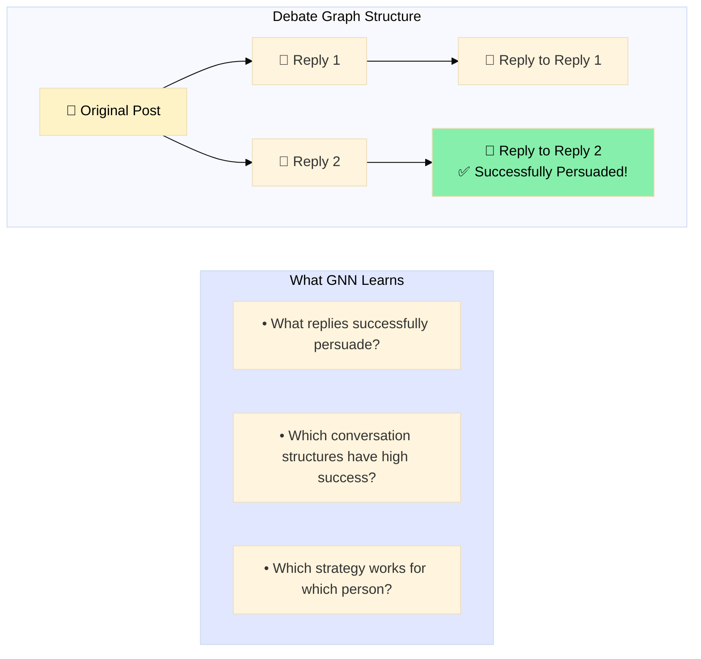

---

## 2.2 GraphSAGE Explained

### The Problem: How to Get Information from Neighbors?

**Traditional Method (GCN)**:
```
Node i's new feature = Σ (neighbor j's feature) / number of neighbors

Problem: High computation, requires entire graph data
```

**GraphSAGE (SAmple and aggreGatE)**:
```
Innovation: Sampling + Aggregation

Step 1: Sample K neighbors (not all)
Step 2: Aggregate neighbor features (mean/max/LSTM)
Step 3: Combine with own features
Step 4: Non-linear transformation

Advantage: Can handle large-scale graphs, can generalize to new nodes
```

### GraphSAGE Mathematical Formula

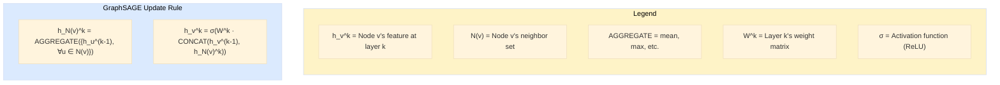

### Code Correspondence (PyTorch Geometric)

```python
# src/gnn/social_encoder.py Line 19-21

self.conv1 = tgnn.SAGEConv(input_dim, hidden_dim)
#           ↑
#    PyTorch Geometric's GraphSAGE layer
#    input_dim = 768 (BERT embedding dimension)
#    hidden_dim = 256

self.conv2 = tgnn.SAGEConv(hidden_dim, hidden_dim)
# Layer 2: 256 → 256

self.conv3 = tgnn.SAGEConv(hidden_dim, 128)
# Layer 3: 256 → 128
```

### What SAGEConv Does Internally

```python
# Simplified version of SAGEConv

class SAGEConv:
    def forward(self, x, edge_index):
        # x: All nodes' features [num_nodes, input_dim]
        # edge_index: Edge list [[source], [target]]
        
        # Step 1: For each node, aggregate neighbor features
        neighbor_features = aggregate_neighbors(x, edge_index)
        # neighbor_features: [num_nodes, input_dim]
        
        # Step 2: Concatenate self and neighbor features
        combined = concat(x, neighbor_features)
        # combined: [num_nodes, input_dim * 2]
        
        # Step 3: Linear transformation
        output = linear_layer(combined)
        # output: [num_nodes, output_dim]
        
        return output
```

---

## 2.3 GAT (Graph Attention) Explained

### The Problem: Should All Neighbors Have Equal Importance?

```
GraphSAGE mean aggregation:
  new_feature = (neighbor1 + neighbor2 + neighbor3) / 3
  
Problem: Each neighbor has weight 1/3, but some neighbors are more important!
```

### GAT's Solution: Attention Mechanism

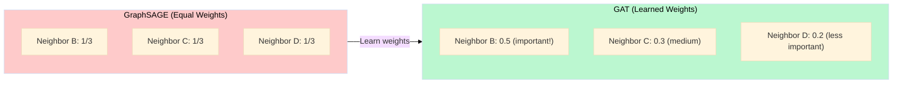

### How Attention Coefficients are Calculated

```
Step 1: Calculate "attention score" for node pairs

e_ij = LeakyReLU(a^T · [W·h_i || W·h_j])
       ↑          ↑    ↑         ↑
   activation  learnable  linear transformed concatenation

Step 2: Softmax normalization

α_ij = softmax_j(e_ij) = exp(e_ij) / Σ_k exp(e_ik)

Step 3: Weighted aggregation

h'_i = σ(Σ_j α_ij · W · h_j)
```

### Multi-Head Attention

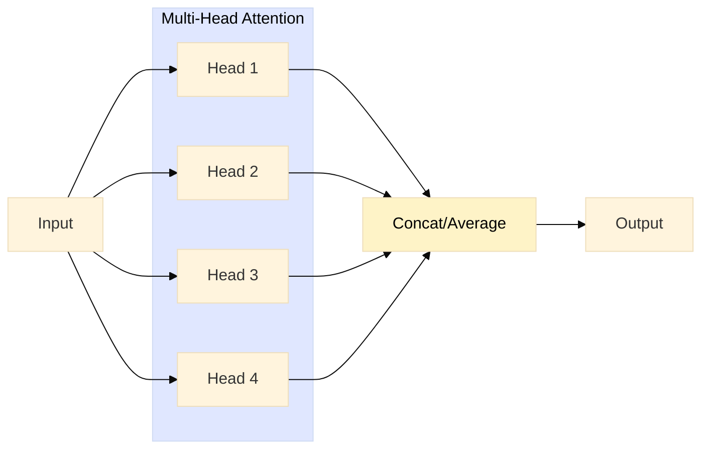

Each head learns different attention patterns!

### Code Correspondence

```python
# src/gnn/social_encoder.py Line 24

self.attention = tgnn.GATConv(128, 128, heads=4, concat=False)
#                              ↑    ↑     ↑       ↑
#                          input  output 4 heads  no concat (average)

# heads=4: Use 4 independent attention heads
# concat=False: Average results from 4 heads
#              If concat=True, would concatenate to 128*4=512 dims
```

---

## 2.4 Project GNN Architecture Analysis

### Complete Architecture Diagram

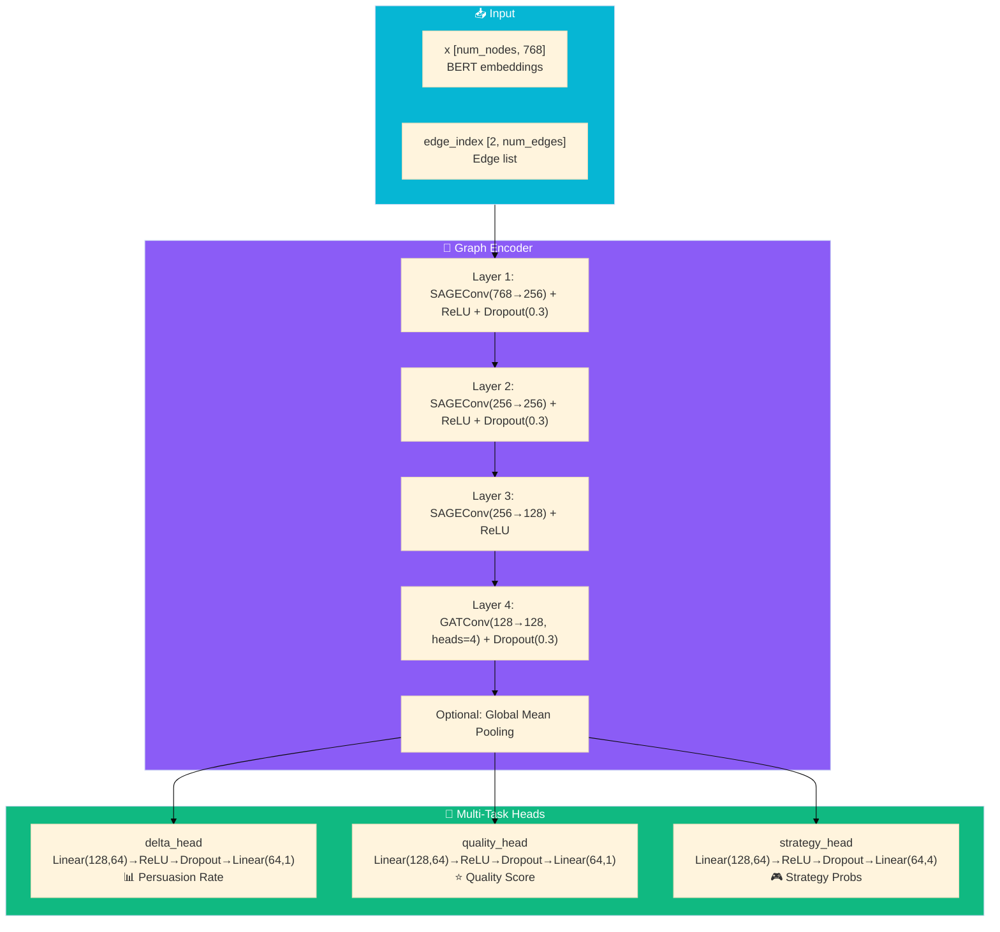

### Code Line-by-Line Analysis

```python
# src/gnn/social_encoder.py

class PersuasionGNN(nn.Module):
    
    def __init__(self, input_dim=768, hidden_dim=256, num_strategies=4):
        super().__init__()
        
        # ====== Graph Convolution Layers ======
        # These three layers progressively compress from 768 to 128 dims
        # while aggregating neighbor information
        
        self.conv1 = tgnn.SAGEConv(input_dim, hidden_dim)
        # input_dim=768: BERT's output dimension
        # hidden_dim=256: Compress to 256 dims
        
        self.conv2 = tgnn.SAGEConv(hidden_dim, hidden_dim)
        # 256 → 256, maintain dimension, continue aggregation
        
        self.conv3 = tgnn.SAGEConv(hidden_dim, 128)
        # 256 → 128, compress again
        
        # ====== Attention Layer ======
        self.attention = tgnn.GATConv(128, 128, heads=4, concat=False)
        # 4 attention heads, learn different attention patterns
        # concat=False: Average 4 heads' results instead of concatenating
        
        # ====== Regularization ======
        self.dropout = nn.Dropout(0.3)
        # 30% nodes randomly zeroed out, prevent overfitting
        
        # ====== Multi-Task Output Heads ======
        # Shared feature extraction, separate prediction for 3 tasks
        
        self.delta_head = nn.Sequential(
            nn.Linear(128, 64),     # 128 → 64
            nn.ReLU(),              # Activation
            nn.Dropout(0.3),        # Regularization
            nn.Linear(64, 1)        # 64 → 1 (binary: successful persuasion?)
        )
        # delta = "change mind", predict if response can persuade
        
        self.quality_head = nn.Sequential(
            nn.Linear(128, 64),
            nn.ReLU(),
            nn.Dropout(0.3),
            nn.Linear(64, 1)        # 64 → 1 (regression: quality score 0-1)
        )
        # Predict response quality score
        
        self.strategy_head = nn.Sequential(
            nn.Linear(128, 64),
            nn.ReLU(),
            nn.Dropout(0.3),
            nn.Linear(64, num_strategies)  # 64 → 4 (4-class)
        )
        # Predict which strategy to use
```

---

## 2.5 GNN Training Pipeline

### Data Preparation

```python
# src/gnn/train_supervised.py

class PersuasionDataset:
    """
    Data source: Reddit's ChangeMyView (CMV) dataset
    CMV is a debate forum where users post opinions,
    and give "delta" (Δ) marks if persuaded
    """
    
    def __init__(self):
        # Use DistilBERT to encode text
        self.tokenizer = AutoTokenizer.from_pretrained('distilbert-base-uncased')
        self.encoder = AutoModel.from_pretrained('distilbert-base-uncased')
        
    def encode_text(self, text: str) -> np.ndarray:
        """
        Convert text to 768-dim vector
        
        "I think AI should be regulated" 
              ↓ DistilBERT
        [0.12, -0.34, 0.56, ...] (768 dims)
        """
        inputs = self.tokenizer(text, truncation=True, max_length=512, 
                                return_tensors='pt')
        outputs = self.encoder(**inputs)
        
        # Take [CLS] token output as sentence representation
        return outputs.last_hidden_state[:, 0, :].numpy().squeeze()
        #                                ↑
        #                        Token 0 = [CLS]
```

### Training Loop

```python
def train_gnn(epochs=50, hidden_dim=256, lr=0.001):
    # Load data
    data, stats = dataset.build_graph()
    
    # Create model
    model = PersuasionGNN(input_dim=768, hidden_dim=hidden_dim)
    optimizer = torch.optim.Adam(model.parameters(), lr=lr)
    
    for epoch in range(epochs):
        model.train()
        optimizer.zero_grad()
        
        # Forward pass
        out = model(data.x, data.edge_index)
        
        # ====== Multi-Task Loss ======
        # Task 1: Persuasion prediction (binary classification)
        delta_loss = F.binary_cross_entropy_with_logits(
            out['delta'].squeeze(),     # Model output
            data.y_delta                # True label (0 or 1)
        )
        
        # Task 2: Quality prediction (regression)
        quality_loss = F.mse_loss(
            out['quality'].squeeze(),   # Model output
            data.y_quality              # True label (0-1)
        )
        
        # Task 3: Strategy classification (4-class)
        strategy_loss = F.cross_entropy(
            out['strategy'],            # Model output [N, 4]
            data.y_strategy             # True label (0, 1, 2, or 3)
        )
        
        # Total loss = weighted sum of three tasks
        total_loss = delta_loss + quality_loss + strategy_loss
        
        # Backward pass
        total_loss.backward()
        optimizer.step()
```

### Why Multi-Task Learning?

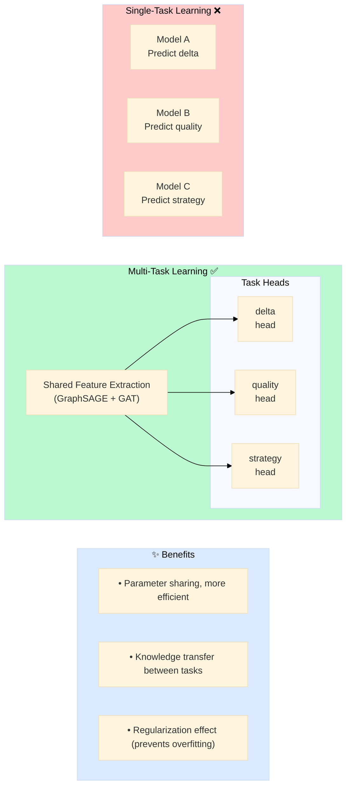

---

## 2.6 GNN Inference Pipeline

### Issue in Current Implementation

```python
# src/orchestrator/debate_tools.py Line 161-162

text_features = np.random.randn(768)  # ⚠️ This is the problem!
persuasion_pred = gnn.predict_persuasion(text_features, agent_id)

# Problem: 
# Training uses DistilBERT-encoded real text
# Inference uses random noise
# This makes model predictions meaningless!
```

### Correct Inference Pipeline Should Be

```python
# Correct approach:

# 1. Get current debate context
context = f"Topic: {topic}. Last message: {last_message}"

# 2. Encode using DistilBERT
text_features = encoder.encode(context)  # [768]

# 3. Call GNN prediction
result = predict_persuasion(text_features, agent_id)

# 4. Results
print(result)
# {
#     'delta_probability': 0.73,        # 73% chance of successful persuasion
#     'quality_score': 0.65,            # Quality score 0.65
#     'best_strategy': 'analytical',    # Suggested strategy
#     'strategy_scores': {
#         'aggressive': 0.15,
#         'defensive': 0.20,
#         'analytical': 0.45,  # Highest
#         'empathetic': 0.20
#     }
# }
```

---

# Part 3: PPO Deep Dive ⭐

## 3.1 Reinforcement Learning Fundamentals

### Core RL Elements

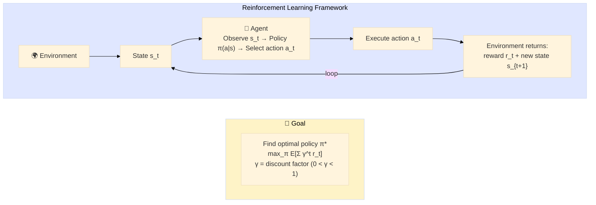

### Project RL Mapping

| RL Concept | Project Mapping |
|--------|-----------|
| **State** | 768-dim vector: BERT embedding of debate context |
| **Action** | 4 strategies: aggressive, defensive, analytical, empathetic |
| **Reward** | Successful persuasion → high reward, refuted → low reward |
| **Policy** | Neural network, input state, output action probabilities |
| **Environment** | Debate simulator |

---

## 3.2 Policy Gradient Methods

### Policy Gradient Intuition

```
Goal: Increase probability of "good actions", decrease probability of "bad actions"

Scenario:
• State s, action a taken, reward r = +1 (good)
• Policy should adjust to increase π(a|s)

• State s, action a taken, reward r = -1 (bad)
• Policy should adjust to decrease π(a|s)
```

### Policy Gradient Formula

```
∇_θ J(θ) = E[∇_θ log π_θ(a|s) · Q(s,a)]
            ↑           ↑         ↑
      gradient w.r.t  action    action
       parameters    probability  value
      
Interpretation:
• ∇_θ log π_θ(a|s): "How to adjust to increase action a's probability"
• Q(s,a): How good is this action
• Multiply: Good action directions amplified, bad action directions reduced
```

### Policy Gradient Problems

```
Problem 1: High Variance
  Reward r fluctuation causes unstable gradient estimates
  
Problem 2: Low Sample Efficiency
  After each update, old data becomes unusable
  
Problem 3: Hard to Tune Step Size
  Step too big → Policy collapse
  Step too small → Learning too slow
```

---

## 3.3 PPO Core Principles

### What Problem Does PPO Solve?

```
Traditional Policy Gradient:
  θ_new = θ_old + α · ∇_θ J(θ)
  
Problem: One update might change policy too much, causing performance crash

PPO Solution:
  Limit new-old policy difference, ensure updates within "trust region"
```

### PPO Core Formula

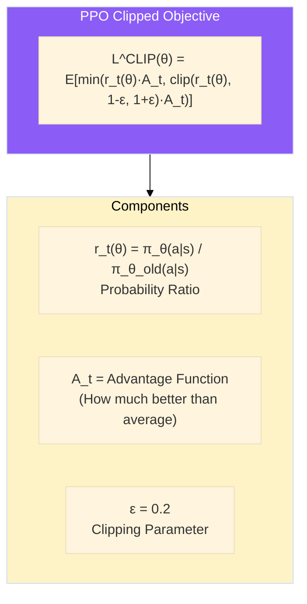

### Clipping Mechanism Explained

```
Assume ε = 0.2, Advantage A = +5 (good action)

Case 1: r = 1.0 (new-old policy same)
  min(1.0 × 5, clip(1.0, 0.8, 1.2) × 5)
= min(5, 1.0 × 5)
= min(5, 5) = 5
→ Normal update

Case 2: r = 1.5 (new policy probability increased 50%)
  min(1.5 × 5, clip(1.5, 0.8, 1.2) × 5)
= min(7.5, 1.2 × 5)
= min(7.5, 6) = 6  ← Clipped!
→ Limit update magnitude, don't let policy change too much

Case 3: r = 0.7 (new policy probability decreased 30%)
  min(0.7 × 5, clip(0.7, 0.8, 1.2) × 5)
= min(3.5, 0.8 × 5)
= min(3.5, 4) = 3.5  ← Not clipped, allow decrease
→ For good actions, don't penalize probability decrease
```

### Visual Understanding

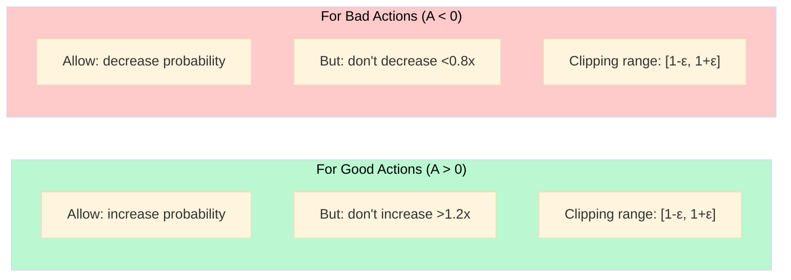

---

## 3.4 Actor-Critic Architecture

### What is Actor-Critic?

```
Actor: Decides "what action to take"
       π(a|s) → Action probability distribution
             
Critic: Evaluates "how much is this state worth"
        V(s) → State value
                 
They cooperate:
• Actor explores and makes decisions
• Critic evaluates and guides

Advantages:
• Lower variance than pure Policy Gradient
• More flexible than pure Value-based methods
```

### Project's Actor-Critic Network

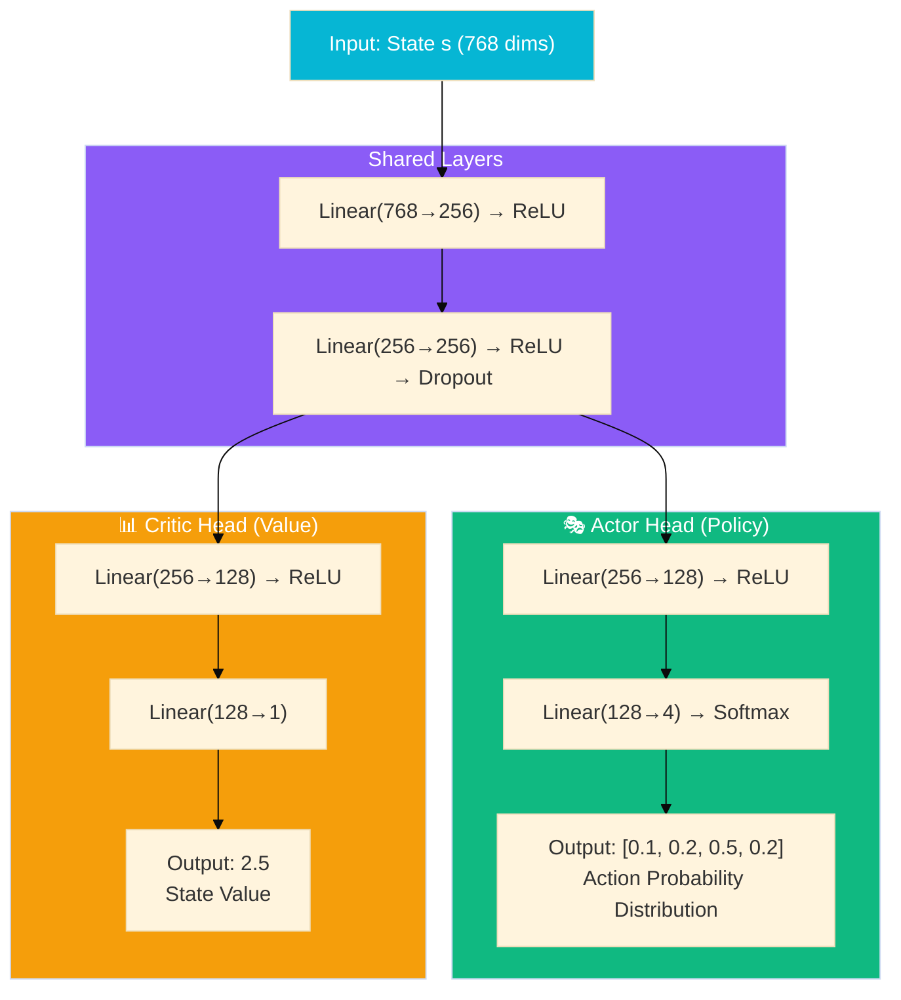

---

## 3.5 GAE (Generalized Advantage Estimation)

### What is Advantage Function?

```
Advantage Function: A(s, a) = Q(s, a) - V(s)
                    ↑         ↑
              action value  state value
              
Interpretation: 
• A > 0: This action is better than average
• A < 0: This action is worse than average
• A = 0: This action is average

Why use Advantage instead of Q directly?
• Reduces variance!
• Even if Q values differ by 1000x between states, advantage can be close to 0
```

### GAE Formula

```
Traditional Advantage Estimate:
  A_t = r_t + γV(s_{t+1}) - V(s_t)
  
Problem: Only looks one step ahead, unstable estimate

GAE (Generalized Advantage Estimation):
  A_t^GAE = Σ_{l=0}^{∞} (γλ)^l · δ_{t+l}
  
Where:
  δ_t = r_t + γV(s_{t+1}) - V(s_t)  (TD error)
  γ = 0.99  (discount factor)
  λ = 0.95  (GAE parameter)
  
Interpretation:
• λ=0: Only look one step (high bias, low variance)
• λ=1: Look until end (low bias, high variance)
• λ=0.95: Balance, works well in practice
```

### Code Implementation

```python
# src/rl/ppo_trainer.py Line 198-228

def _calculate_advantages(self, transitions):
    """Calculate GAE advantages"""
    
    # Step 1: Calculate Return (accumulate backwards)
    returns = []
    G = 0
    for transition in reversed(transitions):
        G = transition.reward + self.gamma * G
        #                       ↑
        #                  γ = 0.99
        returns.insert(0, G)
    
    # Step 2: Calculate GAE advantages
    values = [t.value for t in transitions] + [0]  # Add V=0 for terminal state
    advantages = []
    
    gae = 0
    for i in reversed(range(len(transitions))):
        # TD error
        delta = (transitions[i].reward + 
                self.gamma * values[i + 1] * (1 - transitions[i].done) - 
                values[i])
        # δ_t = r_t + γV(s_{t+1}) - V(s_t)
        #       If terminal state, V(s_{t+1}) = 0
        
        # GAE accumulation
        gae = delta + self.gamma * self.gae_lambda * (1 - transitions[i].done) * gae
        #            ↑            ↑
        #       γ = 0.99     λ = 0.95
        
        advantages.insert(0, gae)
    
    # Step 3: Normalize advantages (reduce variance)
    advantages = torch.tensor(advantages)
    advantages = (advantages - advantages.mean()) / (advantages.std() + 1e-8)
    #             ↑                                  ↑
    #          subtract mean                    divide by std
    
    return advantages
```

---

## 3.6 Project PPO Implementation Analysis

### Network Architecture

```python
# src/rl/ppo_trainer.py Line 27-72

class PPONetwork(nn.Module):
    """PPO's Actor-Critic Network"""
    
    def __init__(self, state_dim=768, action_dim=4, hidden_dim=256):
        super().__init__()
        
        # ====== Shared Layers ======
        # Both branches share this part, save parameters, share features
        self.shared = nn.Sequential(
            nn.Linear(state_dim, hidden_dim),  # 768 → 256
            nn.ReLU(),
            nn.Linear(hidden_dim, hidden_dim), # 256 → 256
            nn.ReLU(),
            nn.Dropout(0.1)                    # 10% Dropout
        )
        
        # ====== Actor Branch (Policy Network) ======
        # Output: Action probability distribution [p(a=0), p(a=1), p(a=2), p(a=3)]
        self.actor = nn.Sequential(
            nn.Linear(hidden_dim, hidden_dim // 2),  # 256 → 128
            nn.ReLU(),
            nn.Linear(hidden_dim // 2, action_dim),  # 128 → 4
            nn.Softmax(dim=-1)                       # Convert to probabilities
        )
        
        # ====== Critic Branch (Value Network) ======
        # Output: State value V(s) (scalar)
        self.critic = nn.Sequential(
            nn.Linear(hidden_dim, hidden_dim // 2),  # 256 → 128
            nn.ReLU(),
            nn.Linear(hidden_dim // 2, 1)            # 128 → 1
        )
```

### Training Loop

```python
# src/rl/ppo_trainer.py Line 230-273

def update_policy(self, trajectories):
    """Update policy using PPO"""
    
    # Prepare data
    states = torch.stack([t.state for t in trajectories])      # [N, 768]
    actions = torch.tensor([t.action for t in trajectories])   # [N]
    old_log_probs = torch.tensor([t.log_prob for t in trajectories])  # [N]
    returns = torch.tensor([t.return_value for t in trajectories])    # [N]
    advantages = torch.tensor([t.advantage for t in trajectories])    # [N]
    
    # ====== PPO Update (multiple epochs) ======
    for _ in range(self.update_epochs):  # update_epochs = 4
        # Forward pass
        action_probs, values = self.network(states)
        dist = Categorical(action_probs)
        
        # Calculate new log probabilities
        new_log_probs = dist.log_prob(actions)
        
        # ====== Calculate Probability Ratio ======
        ratio = torch.exp(new_log_probs - old_log_probs)
        # ratio = π_new(a|s) / π_old(a|s)
        # exp(log_new - log_old) = exp(log(new/old)) = new/old
        
        # ====== PPO Clipped Objective ======
        surr1 = ratio * advantages
        surr2 = torch.clamp(ratio, 1 - self.epsilon, 1 + self.epsilon) * advantages
        #       ↑                    ↑
        #      clip               ε = 0.2
        
        actor_loss = -torch.min(surr1, surr2).mean()
        #            ↑
        #       Negative because we want to maximize, but optimizer minimizes
        
        # ====== Critic Loss ======
        critic_loss = F.mse_loss(values.squeeze(), returns)
        # Make V(s) approach true Return
        
        # ====== Entropy Regularization ======
        entropy = dist.entropy().mean()
        # Higher entropy → more random policy → encourage exploration
        
        # ====== Total Loss ======
        total_loss = actor_loss + 0.5 * critic_loss - 0.01 * entropy
        #                         ↑                   ↑
        #                    critic weight 0.5   entropy bonus 0.01
        
        # Backward pass
        self.optimizer.zero_grad()
        total_loss.backward()
        
        # Gradient clipping (prevent gradient explosion)
        torch.nn.utils.clip_grad_norm_(self.network.parameters(), 0.5)
        
        self.optimizer.step()
```

### Debate Environment (Known Issues)

```python
# src/rl/ppo_trainer.py Line 74-134

class DebateEnvironment:
    """Debate Environment (⚠️ This is a simplified simulation)"""
    
    def __init__(self):
        self.strategies = ['aggressive', 'defensive', 'analytical', 'empathetic']
        
    def reset(self):
        """Reset environment"""
        self.current_stance = 0.0   # Stance
        self.conviction = 0.7       # Belief
        self.round = 0
        self.max_rounds = 5
        
        # ⚠️ Issue: Using random vector instead of real debate state
        self.state = torch.randn(768)
        return self.state
    
    def step(self, action):
        """Execute action"""
        reward = self._calculate_reward(action)
        
        self.round += 1
        self.state = torch.randn(768)  # ⚠️ Issue: Again random vector
        
        done = self.round >= self.max_rounds
        return self.state, reward, done
    
    def _calculate_reward(self, action):
        """Calculate reward (⚠️ Issue: Hardcoded!)"""
        strategy = self.strategies[action]
        
        # These rewards are hardcoded, unrelated to real debate effects!
        if strategy == 'analytical':
            base_reward = 0.8   # Always 0.8
        elif strategy == 'empathetic':
            base_reward = 0.7   # Always 0.7
        elif strategy == 'defensive':
            base_reward = 0.5   # Always 0.5
        elif strategy == 'aggressive':
            base_reward = random.choice([0.3, 0.9])  # Random!
        
        return np.clip(base_reward + np.random.normal(0, 0.1), 0, 1)

# ⚠️ Issues with this environment:
# 1. State is random noise, not real debate context
# 2. Reward is hardcoded, not based on real debate effects
# 3. Model only learns "select analytical gets 0.8"
#    not "select optimal strategy based on situation"
```

---

# Part 4: RAG & LangGraph

## 4.1 RAG Principles and Implementation

### RAG Pipeline

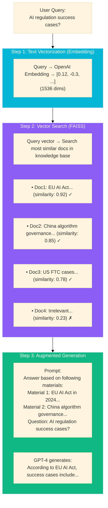

### Project RAG Implementation

```python
# src/rag/retriever.py

class EnhancedRetriever:
    def __init__(self):
        # Use OpenAI's Embedding model
        self.embeddings = OpenAIEmbeddings(model='text-embedding-3-small')
        
        # Vector database: Chroma (based on FAISS)
        self.stores = {}
        
    def retrieve(self, query: str, k: int = 5) -> List[Dict]:
        """
        Retrieve top k most relevant documents
        
        Args:
            query: Query string
            k: Number of documents to return
            
        Returns:
            [{content, similarity_score, metadata}, ...]
        """
        # Search in vector database
        docs = store.similarity_search_with_score(query, k=k*2)
        
        # Filter and sort
        results = []
        for doc, score in docs:
            results.append({
                'content': doc.page_content,
                'similarity_score': float(1 - score),  # Convert to similarity
                'metadata': doc.metadata
            })
        
        return results[:k]
```

---

## 4.2 LangGraph State Machine

### What is StateGraph?

```
Traditional programming flow:
    if condition1:
        if condition2:
            ...
    else:
        ...
    
Problem: Complex, hard to maintain, hard to visualize

StateGraph approach:
    Define states → Define nodes → Define edges → Auto-execute
    
Advantages:
• Declarative, clear and understandable
• Visualizable
• Built-in state management
• Supports parallel execution
```

### Project's StateGraph

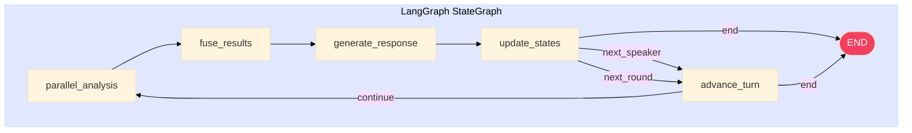

### State Accumulation Magic

```python
# src/orchestrator/debate_state.py

class DebateState(TypedDict):
    topic: str
    current_round: int
    
    # Magic here! 👇
    history: Annotated[List[Dict], operator.add]
    #        ↑                     ↑
    #   type annotation      accumulation: list addition

# When using:
# Node returns {"history": [new_response]}
# LangGraph automatically executes history = history + [new_response]

# Why is this useful?
# No manual list management, won't overwrite previous history
# Each node only cares about "what to add", not "what exists before"
```

---

# Part 5: Reflections & Best Practices

## 5.1 Project Summary

### English Version

```
This project, Social Debate AI, is a multi-agent debate system integrating:

[Core Technologies]
• GNN (GraphSAGE + GAT) to predict persuasion success
• PPO reinforcement learning for dynamic strategy selection
• RAG with FAISS for evidence retrieval
• LangGraph for declarative workflow orchestration

[Key Challenges]
Fusing three ML models with different output semantics required a 
careful strategy fusion layer with conditional routing. I also used 
LangGraph's annotated state schema for automatic history accumulation.

[Results]
The system runs real-time debates with GPT-4, has a Flask web UI, 
and comprehensive tests. The architecture cleanly separates concerns 
while enabling complex orchestration.
```

### 中文版本

```
這個專案 Social Debate AI 是一個整合以下技術的多智能體辯論系統：

【核心技術】
• GNN (GraphSAGE + GAT) 預測說服成功率
• PPO 強化學習進行動態策略選擇
• RAG + FAISS 進行證據檢索
• LangGraph 進行宣告式工作流編排

【關鍵挑戰】
融合三個輸出語義不同的 ML 模型，需要設計帶有條件路由的
策略融合層。我還使用 LangGraph 的 annotated state schema
實現歷史紀錄的自動累積。

【成果】
系統支援與 GPT-4 的即時辯論，有 Flask Web 介面和完整測試。
架構在實現複雜編排的同時，能清晰地分離關注點。
```

---

## 5.2 Key Technical Challenges

### Challenge 1: GNN Training-Serving Skew

**Issue:** The GNN inputs random vector `np.random.randn(768)` during inference,
but training uses BERT encoding. How can the model be meaningful?

**Analysis:**
```
Root Cause:
- Training: DistilBERT encodes real text
- Inference: Random noise
- Result: GNN predictions are meaningless

Fix:
Add TextEncoder singleton class, use DistilBERT for encoding during inference too

Lesson:
Establish end-to-end tests early in development,
ensure training and inference feature pipelines are consistent.
```

### Challenge 2: PPO Sim2Real Gap

**Issue:** RL training environment uses hardcoded rewards (analytical=0.8),
but real system uses keyword counting for evaluation. How can this policy be effective?

**Analysis:**
```
Root Cause:
- Training: strategy → hardcoded reward
- Real: strategy → LLM → keyword evaluation → reward
- Causation chains are completely different

Fix Options:
1. Online RL: Train with real LLM (expensive)
2. Offline RL: Learn from logs
3. Supervised Learning: Simpler, learn from successful cases

Pragmatic Choice:
Given API costs, start with supervised learning,
migrate to Offline RL after sufficient logs.
```

### Challenge 3: Event Loop Issues

**Issue:** Creating new event loop on every `_parallel_analysis_node` call,
what happens if called from FastAPI?

**Analysis:**
```
Problems:
1. Performance overhead: Creating/destroying event loop each time
2. Conflict: FastAPI already has event loop, would trigger RuntimeError
3. Useless: Only using ThreadPoolExecutor, don't need event loop at all

Fix:
Remove event loop creation, directly use concurrent.futures.wait()

Lesson:
Understand async/threading differences,
consider code behavior in different contexts.
```

---

## 5.3 Knowledge Checklist

### Must-Know Concepts

- [ ] What problem does the project solve?
- [ ] What's the difference between GraphSAGE and GAT in GNN?
- [ ] Why is PPO's clipping mechanism effective?
- [ ] What's the purpose of GAE's λ parameter?
- [ ] What does `operator.add` mean in LangGraph?
- [ ] Why use multi-task learning?

### Known Limitations

- [ ] GNN inference placeholder issue
- [ ] PPO training environment's Sim2Real gap
- [ ] Event loop concurrency issue

### Advanced Topics

- [ ] Can draw GNN forward propagation flow
- [ ] Can write PPO loss function
- [ ] Can explain GAE mathematical derivation
- [ ] Can propose concrete fix solutions

---

# 📖 Glossary

| Term | Full Name | Explanation |
|-----|------|------|
| GNN | Graph Neural Network | Neural network for processing graph-structured data |
| GraphSAGE | Sample and Aggregate | Graph convolution method with sampling + aggregation |
| GAT | Graph Attention Network | Graph neural network with attention mechanism |
| PPO | Proximal Policy Optimization | RL algorithm for stable policy updates |
| GAE | Generalized Advantage Estimation | Technique for estimating advantages in RL |
| Actor-Critic | - | Dual network architecture with policy + value |
| RAG | Retrieval Augmented Generation | Generation enhanced by retrieval |
| FAISS | Facebook AI Similarity Search | Facebook's vector search library |
| LangGraph | - | LangChain's graph workflow framework |
| Embedding | - | Technique to convert text to vectors |
| Softmax | - | Convert vector to probability distribution |
| Cross-Entropy | - | Loss function for classification tasks |

---

*Deep Learning Study Notes for Social Debate AI*  
*Topics: GNN, PPO, RAG, LangGraph*  
*Last Updated: December 2024*
