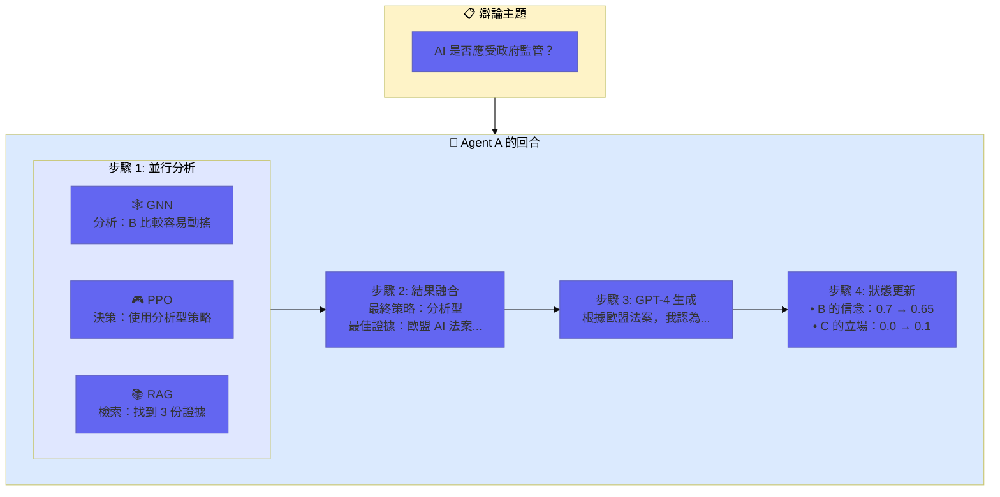
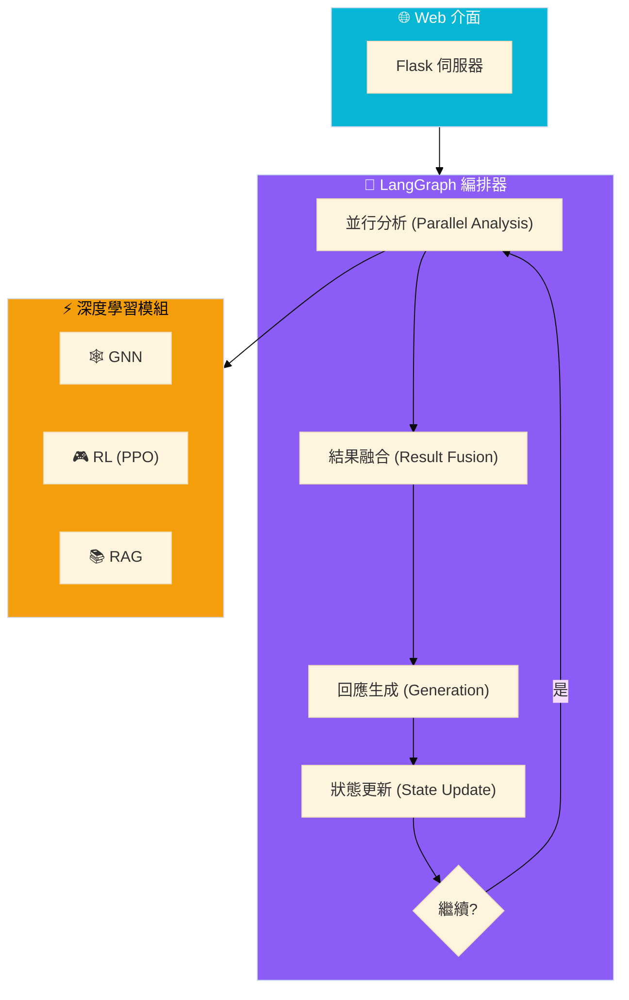
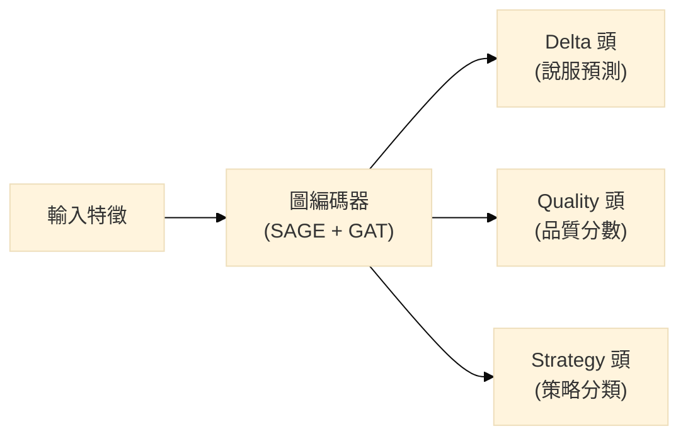
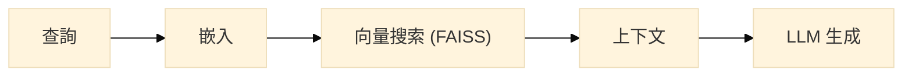

# 📚 深度學習學習筆記
## Social Debate AI - 多智能體社交辯論系統

> **關於本文檔**：這是一份綜合性的學習筆記，記錄了在本專案中應用 GNN（圖神經網路）、PPO（強化學習）、RAG（檢索增強生成）和 LangGraph 的核心概念、架構設計與實作細節。

---

# 📑 目錄

## 第一部分：專案基礎
- [1.1 這是什麼專案？](#11-這是什麼專案)
- [1.2 系統架構概覽](#12-系統架構概覽)
- [1.3 程式碼結構](#13-程式碼結構)

## 第二部分：GNN 深度解析 ⭐
- [2.1 什麼是圖神經網路？](#21-什麼是圖神經網路)
- [2.2 GraphSAGE 解析](#22-graphsage-解析)
- [2.3 GAT (圖注意力機制) 解析](#23-gat-圖注意力機制-解析)
- [2.4 專案 GNN 架構分析](#24-專案-gnn-架構分析)
- [2.5 GNN 訓練流程](#25-gnn-訓練流程)
- [2.6 GNN 推理流程](#26-gnn-推理流程)

## 第三部分：PPO 深度解析 ⭐
- [3.1 強化學習基礎](#31-強化學習基礎)
- [3.2 策略梯度方法](#32-策略梯度方法)
- [3.3 PPO 核心原理](#33-ppo-核心原理)
- [3.4 Actor-Critic 架構](#34-actor-critic-架構)
- [3.5 GAE (廣義優勢估計)](#35-gae-廣義優勢估計)
- [3.6 專案 PPO 實作分析](#36-專案-ppo-實作分析)

## 第四部分：RAG 與 LangGraph
- [4.1 RAG 原理與實作](#41-rag-原理與實作)
- [4.2 LangGraph 狀態機](#42-langgraph-狀態機)

## 第五部分：反思與最佳實踐
- [5.1 專案總結](#51-專案總結)
- [5.2 關鍵技術挑戰](#52-關鍵技術挑戰)
- [5.3 知識檢核清單](#53-知識檢核清單)

---

# 第一部分：專案基礎

## 1.1 這是什麼專案？

### 一句話總結
**Social Debate AI** 是一個多智能體系統，讓 3 個 AI 辯手彼此辯論，每個 AI 都配備了先進的深度學習技術：
1.  **GNN**：分析「誰比較容易被說服」。
2.  **RL (PPO)**：選擇最佳辯論策略（激進/防守/分析/同理）。
3.  **RAG**：檢索真實世界的證據資料。
4.  **GPT-4**：根據上述資訊生成辯論內容。

### 視覺化理解



---

## 1.2 系統架構概覽



---

## 1.3 程式碼結構

```
Social-Debate-AI/
│
├── src/
│   ├── gnn/                      # 🧠 圖神經網路
│   │   ├── social_encoder.py     # 模型定義
│   │   └── train_supervised.py   # 訓練腳本
│   │
│   ├── rl/                       # 🎮 強化學習
│   │   ├── policy_network.py     # PPO Actor-Critic 網路
│   │   └── ppo_trainer.py        # PPO 訓練器與環境
│   │
│   ├── rag/                      # 🔍 知識檢索
│   │   ├── retriever.py          # 增強型檢索器
│   │   └── simple_retriever.py   # 基礎檢索器
│   │
│   └── orchestrator/             # 🎯 編排器
│       ├── langgraph_orchestrator.py  # 工作流引擎
│       ├── debate_state.py            # 狀態定義 (Schema)
│       └── debate_tools.py            # 模組封裝工具
```

---

# 第二部分：GNN 深度解析 ⭐

## 2.1 什麼是圖神經網路？

傳統的神經網路 (MLP) 處理固定大小的向量，而 **GNN (圖神經網路)** 專門處理圖結構數據（節點 + 邊）。

在我們的辯論系統中，辯論歷史構成了一張圖：
*   **節點 (Nodes)**：發文和回覆。
*   **邊 (Edges)**：回覆關係（誰回覆了誰）。
*   **特徵 (Features)**：文本嵌入向量 (DistilBERT)。

**目標**：學習哪些論點具有說服力，以及影響力如何在對話結構中傳播。

---

## 2.2 GraphSAGE 解析

**GraphSAGE (Sample and Aggregate)** 解決了傳統 GCN 的擴展性問題。它不使用整張圖的矩陣，而是透過「採樣」鄰居並「聚合」特徵來運作。

**關鍵步驟：**
1.  **採樣 (Sample)**：為每個節點隨機選取固定數量的鄰居。
2.  **聚合 (Aggregate)**：結合鄰居的特徵（例如取平均值或最大值）。
3.  **更新 (Update)**：將聚合後的鄰居資訊與節點自身的特徵結合。

### 程式碼對應 (PyTorch Geometric)

```python
# src/gnn/social_encoder.py

self.conv1 = tgnn.SAGEConv(input_dim, hidden_dim)
# input_dim = 768 (BERT 嵌入維度)
# hidden_dim = 256
```

---

## 2.3 GAT (圖注意力機制) 解析

**GAT (Graph Attention Network)** 改進了 GraphSAGE，它為不同的鄰居分配 **可學習的權重**。並非所有的回覆都同等重要！

**機制：**
1.  計算每對鄰居之間的 **注意力分數 (Attention Score)**。
2.  使用 **Softmax** 正規化分數。
3.  計算鄰居特徵的加權總和。

**多頭注意力 (Multi-Head Attention)**：我們使用 `heads=4`，讓模型能同時學習不同類型的關係模式。

```python
# src/gnn/social_encoder.py
self.attention = tgnn.GATConv(128, 128, heads=4, concat=False)
```

---

## 2.4 專案 GNN 架構分析

我們的模型採用 **多任務學習 (Multi-Task Learning)** 架構：

1.  **編碼器 (Encoder)**：3 層 GraphSAGE（特徵壓縮）+ 1 層 GAT（注意力機制）。
2.  **輸出頭 (Heads)**：
    *   `delta_head`：二元分類（是否成功說服？0/1）
    *   `quality_head`：回歸（品質分數 0.0-1.0）
    *   `strategy_head`：分類（使用哪種策略？0-3）



---

## 2.5 GNN 訓練流程

我們使用 Reddit 的 **ChangeMyView (CMV)** 數據集。
*   **輸入**：經 DistilBERT 編碼的文本 (`[768]`)。
*   **標籤**：Delta (被說服)、分數、策略類型。
*   **損失函數**：BCE (說服) + MSE (品質) + CrossEntropy (策略) 的加權總和。

---

## 2.6 GNN 推理流程

**關鍵注意點**：必須確保推理 (Inference) 流程與訓練 (Training) 流程一致。
*   **訓練時**：真實文本 -> DistilBERT -> GNN。
*   **推理時**：真實辯論上下文 -> DistilBERT -> GNN。

*(切勿在推理時使用隨機噪聲向量，這在「技術挑戰」章節有詳細討論。)*

---

# 第三部分：PPO 深度解析 ⭐

## 3.1 強化學習基礎

*   **Agent (智能體)**：辯論者。
*   **Environment (環境)**：辯論模擬（其他智能體 + 評判系統）。
*   **State (狀態)**：768 維的上下文向量。
*   **Action (動作)**：選擇策略（激進、防守、分析、同理）。
*   **Reward (獎勵)**：根據說服分數的變化給予獎勵。

---

## 3.2 策略梯度方法 (Policy Gradient)

策略梯度直接優化策略 `π(a|s)` 以最大化預期獎勵。
*   **核心思想**：如果某個動作帶來高獎勵，就增加該動作的機率。
*   **問題**：變異數大，更新不穩定。

---

## 3.3 PPO 核心原理

**PPO (近端策略優化)** 透過限制單次更新的幅度來穩定訓練。

**截斷目標函數 (Clipped Objective)**：
它使用比率 `r(θ) = π_new / π_old`。如果 `r(θ)` 偏離 1 太遠（例如 > 1.2 或 < 0.8），更新會被截斷 (clipped)。這防止了標準 RL 中常見的「策略崩潰」問題。

---

## 3.4 Actor-Critic 架構

我們的 PPO 實作使用 **Actor-Critic** 網路：
1.  **Actor (策略)**：輸出動作機率（該選哪個策略？）。
2.  **Critic (價值)**：估計狀態價值（目前局勢有多好？）。

共享層負責提取特徵，隨後分為兩個獨立的頭進行輸出。

---

## 3.5 GAE (廣義優勢估計)

我們使用 **GAE** 來計算「優勢 (Advantage)」（即某個動作比平均好多少）。
*   結合了 **TD-Error**（短期）和 **Monte-Carlo**（長期）回報。
*   由參數 `lambda` (0.95) 控制權衡。

---

## 3.6 專案 PPO 實作分析

### 網路結構
```python
# src/rl/ppo_trainer.py
self.shared = nn.Linear(768, 256)
self.actor = nn.Linear(256, 4)  # 4 種策略
self.critic = nn.Linear(256, 1) # 價值標量
```

### 獎勵設計 (Reward Design)
獎勵函數的設計至關重要。
*   **稀疏獎勵 (Sparse)**：只有對手投降時給 +1（很難學）。
*   **密集獎勵 (Dense)**：對手說服分數每增加一點就給 +0.1（效果較好）。

---

# 第四部分：RAG 與 LangGraph

## 4.1 RAG 原理與實作

**RAG (檢索增強生成)** 彌補了 LLM 知識凍結與即時事實之間的落差。

**流程**：
1.  **查詢 (Query)**：「AI 監管案例」。
2.  **嵌入 (Embed)**：轉換為向量 (OpenAI `text-embedding-3-small`)。
3.  **搜索 (Search)**：在 FAISS 資料庫中尋找最近鄰。
4.  **生成 (Generate)**：將檢索到的文件 + 查詢一起餵給 GPT-4。



---

## 4.2 LangGraph 狀態機

**LangGraph** 允許我們將辯論流程定義為一張圖。

*   **State (狀態)**：`DebateState` (TypedDict) 保存對話歷史。
*   **Nodes (節點)**：Python 函數（如 `parallel_analysis`, `generate_response`）。
*   **Edges (邊)**：轉換邏輯（如 `should_continue`）。

**關鍵特性**：`Annotated[List[Dict], operator.add]`。這告訴 LangGraph 將新訊息 **追加 (append)** 到歷史列表，而不是覆蓋它。

---

# 第五部分：反思與最佳實踐

## 5.1 專案總結

本專案整合了 GNN、PPO、RAG 和 LangGraph，打造了一個複雜的辯論系統。主要成就在於利用狀態機將這些不同的 AI 模組編排成一個連貫的流程，實現動態且有依據的辯論回應。

## 5.2 關鍵技術挑戰

1.  **訓練-推理偏差 (Training-Inference Skew)**：確保 GNN/RL 模型在生產環境接收到的特徵分佈與訓練時一致至關重要。
2.  **獎勵工程 (Reward Engineering)**：在 RL 中，「你優化什麼就會得到什麼」。設計不良的獎勵會導致模型鑽漏洞（例如重複同一句「最佳」話術）。
3.  **非同步並發 (Async Concurrency)**：在結合 LangGraph（非同步）與 PyTorch（阻塞式）時，管理事件循環 (Event Loop) 需要小心處理執行緒。

## 5.3 知識檢核清單

- [ ] GraphSAGE 與 GAT 的區別？
- [ ] 為什麼 PPO 需要截斷 (clipping)？
- [ ] RAG 嵌入搜索是如何運作的？
- [ ] LangGraph 的狀態規約器 (`operator.add`) 是什麼？

---
*最後更新：2024 年 12 月*

