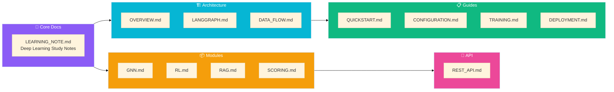
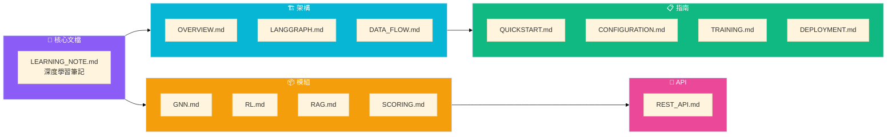

# 📚 Social Debate AI Documentation

*English | [中文](#中文版本)*

Welcome to the Social Debate AI documentation! This comprehensive guide covers system architecture, module references, and practical guides.

---

## 📑 Documentation Structure

---

## 🚀 Quick Navigation

### 📖 Core Learning Resource

| Document | Description |
|----------|-------------|
| **[LEARNING_NOTE.md](LEARNING_NOTE.md)** | 📚 Comprehensive deep learning study notes covering GNN, PPO, RAG, and LangGraph with code examples and Mermaid diagrams |

> **Start here!** This is the most complete resource for understanding the technical details of the project.

---

### 🏗️ Architecture

| Document | Description |
|----------|-------------|
| [System Overview](architecture/OVERVIEW.md) | High-level architecture and component overview |
| [LangGraph Orchestration](architecture/LANGGRAPH.md) | StateGraph-based workflow engine |
| [Data Flow](architecture/DATA_FLOW.md) | State management and data flow |

---

### 📦 Module Quick Reference

| Module | Description | Deep Dive |
|--------|-------------|-----------|
| [GNN Module](modules/GNN.md) | Graph Neural Network for social analysis | [LEARNING_NOTE §2](LEARNING_NOTE.md#part-2-gnn-deep-dive-) |
| [RL Module](modules/RL.md) | PPO reinforcement learning for strategy | [LEARNING_NOTE §3](LEARNING_NOTE.md#part-3-ppo-deep-dive-) |
| [RAG Module](modules/RAG.md) | Evidence retrieval system | [LEARNING_NOTE §4.1](LEARNING_NOTE.md#41-rag-principles-and-implementation) |
| [Scoring System](modules/SCORING.md) | Debate evaluation and victory determination | - |

---

### 📋 Practical Guides

| Guide | Description |
|-------|-------------|
| [Quick Start](guides/QUICKSTART.md) | Get up and running in 5 minutes |
| [Configuration](guides/CONFIGURATION.md) | System configuration reference |
| [Training](guides/TRAINING.md) | Model training instructions |
| [Deployment](guides/DEPLOYMENT.md) | Production deployment guide |

---

### 🔌 API Reference

| Document | Description |
|----------|-------------|
| [REST API](api/REST_API.md) | Flask API endpoints reference |

---

## 📊 Version History

| Version | Date | Changes |
|---------|------|---------|
| 0.2.1 | 2025-12 | Restructured docs with LEARNING_NOTE as core resource |
| 0.2.0 | 2025-12 | Added LangGraph orchestration, restructured documentation |
| 0.1.0 | 2025-07 | Initial release with manual orchestration |

---

# 📚 Social Debate AI 文檔

*[English](#-social-debate-ai-documentation) | 中文*

歡迎使用 Social Debate AI 文檔！本指南涵蓋系統架構、模組參考和實用指南。

---

## 📑 文檔結構

---

## 🚀 快速導航

### 📖 核心學習資源

| 文檔 | 說明 |
|------|------|
| **[LEARNING_NOTE.md](LEARNING_NOTE.md)** | 📚 完整的深度學習筆記，涵蓋 GNN、PPO、RAG 和 LangGraph，包含程式碼範例和 Mermaid 圖表 |

> **從這裡開始！** 這是了解專案技術細節最完整的資源。

---

### 🏗️ 架構

| 文檔 | 說明 |
|------|------|
| [系統概覽](architecture/OVERVIEW.md) | 高層架構和組件概述 |
| [LangGraph 編排](architecture/LANGGRAPH.md) | 基於 StateGraph 的工作流引擎 |
| [資料流](architecture/DATA_FLOW.md) | 狀態管理和資料流 |

---

### 📦 模組快速參考

| 模組 | 說明 | 深入了解 |
|------|------|----------|
| [GNN 模組](modules/GNN.md) | 社交分析圖神經網路 | [LEARNING_NOTE §2](LEARNING_NOTE.md#part-2-gnn-deep-dive-) |
| [RL 模組](modules/RL.md) | PPO 強化學習策略 | [LEARNING_NOTE §3](LEARNING_NOTE.md#part-3-ppo-deep-dive-) |
| [RAG 模組](modules/RAG.md) | 證據檢索系統 | [LEARNING_NOTE §4.1](LEARNING_NOTE.md#41-rag-principles-and-implementation) |
| [評分系統](modules/SCORING.md) | 辯論評估和勝負判定 | - |

---

### 📋 實用指南

| 指南 | 說明 |
|------|------|
| [快速開始](guides/QUICKSTART.md) | 5 分鐘內啟動系統 |
| [配置指南](guides/CONFIGURATION.md) | 系統配置參考 |
| [訓練指南](guides/TRAINING.md) | 模型訓練說明 |
| [部署指南](guides/DEPLOYMENT.md) | 生產環境部署 |

---

### 🔌 API 參考

| 文檔 | 說明 |
|------|------|
| [REST API](api/REST_API.md) | Flask API 端點參考 |

---

## 📊 版本歷史

| 版本 | 日期 | 變更 |
|------|------|------|
| 0.2.1 | 2025-12 | 重構文檔，以 LEARNING_NOTE 為核心資源 |
| 0.2.0 | 2025-12 | 新增 LangGraph 編排，重組文檔結構 |
| 0.1.0 | 2025-07 | 初始版本，手動編排 |
