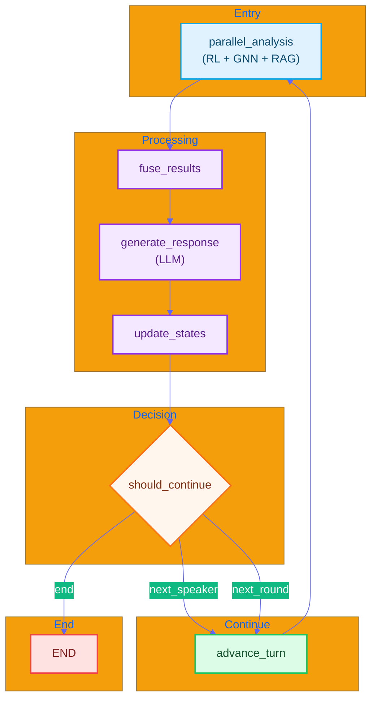
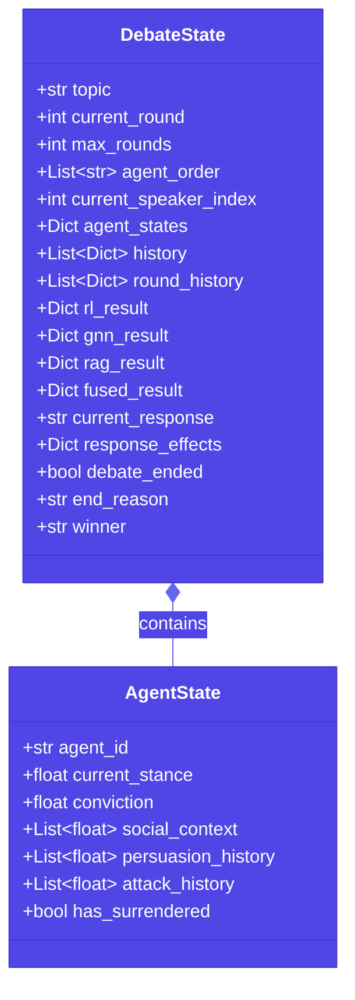
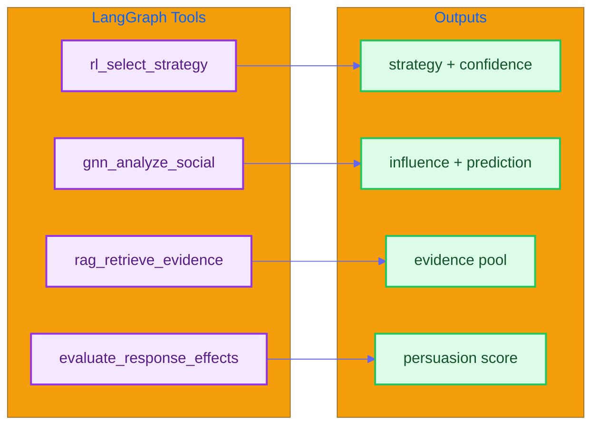
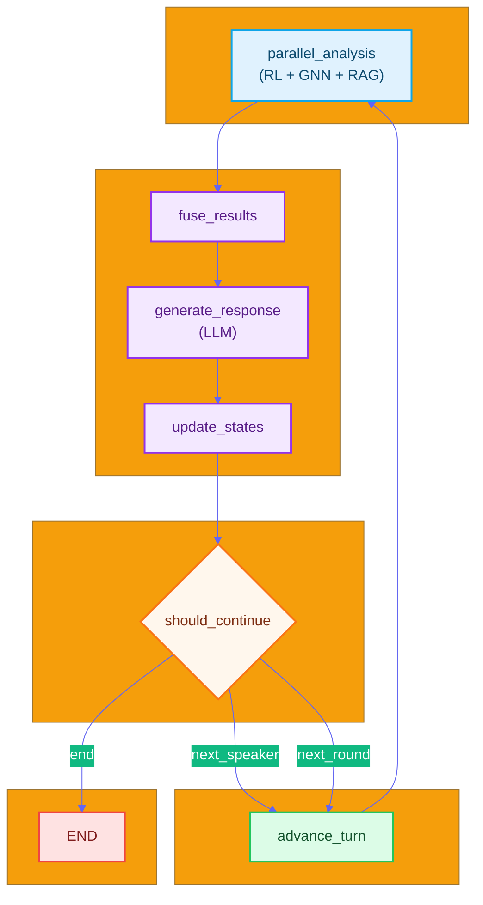

#  LangGraph Orchestration Architecture

*English | [](#)*

---

## Overview

Version 0.2.0 introduces a **LangGraph-based orchestrator** that replaces manual async orchestration with a declarative, graph-based workflow.

---

## Why LangGraph?

| Aspect | Before (Manual) | After (LangGraph) |
|--------|-----------------|-------------------|
| Parallel Execution | Manual asyncio + ThreadPoolExecutor | Built-in parallel branches |
| State Management | Manual dict + dataclass | Automatic via StateGraph |
| Flow Control | Hardcoded if/else + while | Declarative graph + conditional edges |
| Visualization | None | `graph.get_graph().draw_png()` |
| Checkpointing | None | Built-in memory persistence |
| Tool Calling | Manual function calls | ToolNode + Agent autonomous decisions |

---

## Graph Structure



---

## State Schema



```python
class DebateState(TypedDict):
    # Core debate info
    topic: str
    current_round: int
    max_rounds: int
    
    # Agent management
    agent_order: List[str]
    current_speaker_index: int
    agent_states: Dict[str, Any]
    
    # History tracking (with operator.add for accumulation)
    history: Annotated[List[Dict], operator.add]
    round_history: List[Dict]
    
    # Analysis results
    rl_result: Optional[Dict]
    gnn_result: Optional[Dict]
    rag_result: Optional[Dict]
    fused_result: Optional[Dict]
    
    # Control flags
    debate_ended: bool
    end_reason: Optional[str]
    winner: Optional[str]
```

---

## Tools

The system defines four LangGraph tools:



| Tool | Purpose | Returns |
|------|---------|---------|
| `rl_select_strategy` | Select optimal debate strategy | strategy, quality_score, confidence |
| `gnn_analyze_social` | Analyze social influence | influence_score, persuasion_prediction, stance_trend |
| `rag_retrieve_evidence` | Retrieve supporting evidence | evidence_pool, best_evidence, evidence_types |
| `evaluate_response_effects` | Evaluate response impact | persuasion_score, attack_score, evidence_score |

---

## Node Implementation

### Parallel Analysis Node

```python
def _parallel_analysis_node(self, state: DebateState) -> Dict:
    # Execute RL, GNN, RAG in parallel using ThreadPoolExecutor
    with ThreadPoolExecutor(max_workers=3) as executor:
        rl_future = executor.submit(rl_select_strategy.invoke, {...})
        gnn_future = executor.submit(gnn_analyze_social.invoke, {...})
        rag_future = executor.submit(rag_retrieve_evidence.invoke, {...})
    
        return {
            "rl_result": rl_future.result(),
            "gnn_result": gnn_future.result(),
            "rag_result": rag_future.result()
        }
```

### Conditional Routing

```python
def _should_continue(self, state: DebateState) -> Literal["next_speaker", "next_round", "end"]:
    # Check surrender conditions
    for agent_state in state["agent_states"].values():
        if agent_state.get('has_surrendered'):
            return "end"
    
    # Check round completion
    if current_speaker_index >= len(agent_order):
        if current_round >= max_rounds:
            return "end"
        return "next_round"
    
    return "next_speaker"
```

---

## Usage

### Basic Usage

```python
from src.orchestrator import create_langgraph_orchestrator

orchestrator = create_langgraph_orchestrator(
    model_name="gpt-3.5-turbo",
    temperature=0.7
)

results = orchestrator.run_debate(
    topic="Should AI be regulated?",
    agent_configs=[
        {'id': 'Agent_A', 'initial_stance': 0.8, 'initial_conviction': 0.7},
        {'id': 'Agent_B', 'initial_stance': -0.6, 'initial_conviction': 0.7},
        {'id': 'Agent_C', 'initial_stance': 0.0, 'initial_conviction': 0.7}
    ],
    max_rounds=5
)
```

### Step-by-Step Execution

```python
# For UI integration with round-by-round control
state = create_initial_state(topic, agent_configs, max_rounds)

for event in orchestrator.compiled_graph.stream(state):
    # Process each step
    print(event)
```

---

## Configuration

### Environment Variables

```bash
# Use LangGraph orchestrator (default: true)
USE_LANGGRAPH=true

# OpenAI API key (required for LLM)
OPENAI_API_KEY=sk-...
```

### Fallback Behavior

If LangGraph initialization fails, the system automatically falls back to the legacy `ParallelOrchestrator`.

---

## Comparison with Legacy Orchestrator

| Metric | Legacy | LangGraph |
|--------|--------|-----------|
| Lines of Code | ~900 | ~400 |
| State Management | Manual | Automatic |
| Debugging | Difficult | Graph visualization |
| Extensibility | Low | High |

### Benefits

1. **Clearer State Transitions**: Declarative graph makes flow explicit
2. **Built-in Parallelism**: No manual async management
3. **Better Debugging**: Graph visualization available
4. **Extensibility**: Easy to add new nodes/tools
5. **Memory/Checkpointing**: Built-in support for state persistence

---

## File Structure

```
src/orchestrator/
 __init__.py                 # Module exports
 parallel_orchestrator.py    # Legacy orchestrator (fallback)
 langgraph_orchestrator.py   # LangGraph orchestrator
 debate_state.py             # State schema definitions
 debate_tools.py             # LangGraph tools
```

---

<a name=""></a>

#  LangGraph 

*[English](#-langgraph-orchestration-architecture) | *

---

## 

v0.2.0  **LangGraph **

---

##  LangGraph

|  | | LangGraph|
|------|------------|------------------|
|  |  asyncio + ThreadPoolExecutor |  |
|  |  dict + dataclass | StateGraph  |
|  |  if/else + while |  +  |
|  |  | `graph.get_graph().draw_png()` |
|  |  |  |
|  |  | ToolNode + Agent  |

---

## 



---

## 

```python
class DebateState(TypedDict):
    # 
    topic: str                    # 
    current_round: int            # 
    max_rounds: int               # 
    
    # Agent 
    agent_order: List[str]        # Agent 
    current_speaker_index: int    # 
    agent_states: Dict[str, Any]  #  Agent 
    
    #  operator.add 
    history: Annotated[List[Dict], operator.add]
    round_history: List[Dict]
    
    # 
    rl_result: Optional[Dict]
    gnn_result: Optional[Dict]
    rag_result: Optional[Dict]
    fused_result: Optional[Dict]
    
    # 
    debate_ended: bool
    end_reason: Optional[str]
    winner: Optional[str]
```

---

## 

 LangGraph 

|  |  |  |
|------|------|--------|
| `rl_select_strategy` |  | strategy, quality_score, confidence |
| `gnn_analyze_social` |  | influence_score, persuasion_prediction, stance_trend |
| `rag_retrieve_evidence` |  | evidence_pool, best_evidence, evidence_types |
| `evaluate_response_effects` |  | persuasion_score, attack_score, evidence_score |

---

## 

### 

```python
from src.orchestrator import create_langgraph_orchestrator

orchestrator = create_langgraph_orchestrator(
    model_name="gpt-3.5-turbo",
    temperature=0.7
)

results = orchestrator.run_debate(
    topic="AI ",
    agent_configs=[
        {'id': 'Agent_A', 'initial_stance': 0.8, 'initial_conviction': 0.7},
        {'id': 'Agent_B', 'initial_stance': -0.6, 'initial_conviction': 0.7},
        {'id': 'Agent_C', 'initial_stance': 0.0, 'initial_conviction': 0.7}
    ],
    max_rounds=5
)
```

---

## 

|  |  | LangGraph |
|------|------|-----------|
|  | ~900 | ~400 |
|  |  |  |
|  |  |  |
|  |  |  |

### 

1. ****
2. ****
3. ****
4. ****/
5. **/**

---

## 

```
src/orchestrator/
 __init__.py                 # 
 parallel_orchestrator.py    # 
 langgraph_orchestrator.py   # LangGraph 
 debate_state.py             # 
 debate_tools.py             # LangGraph 
```
