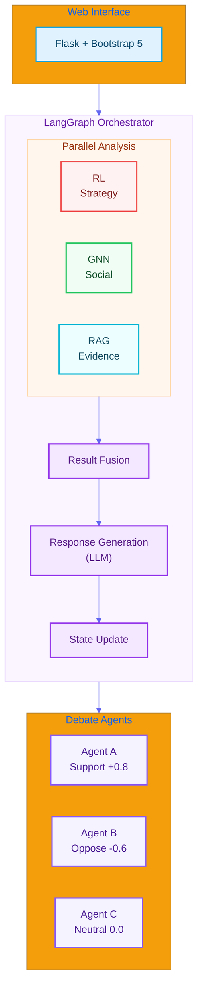
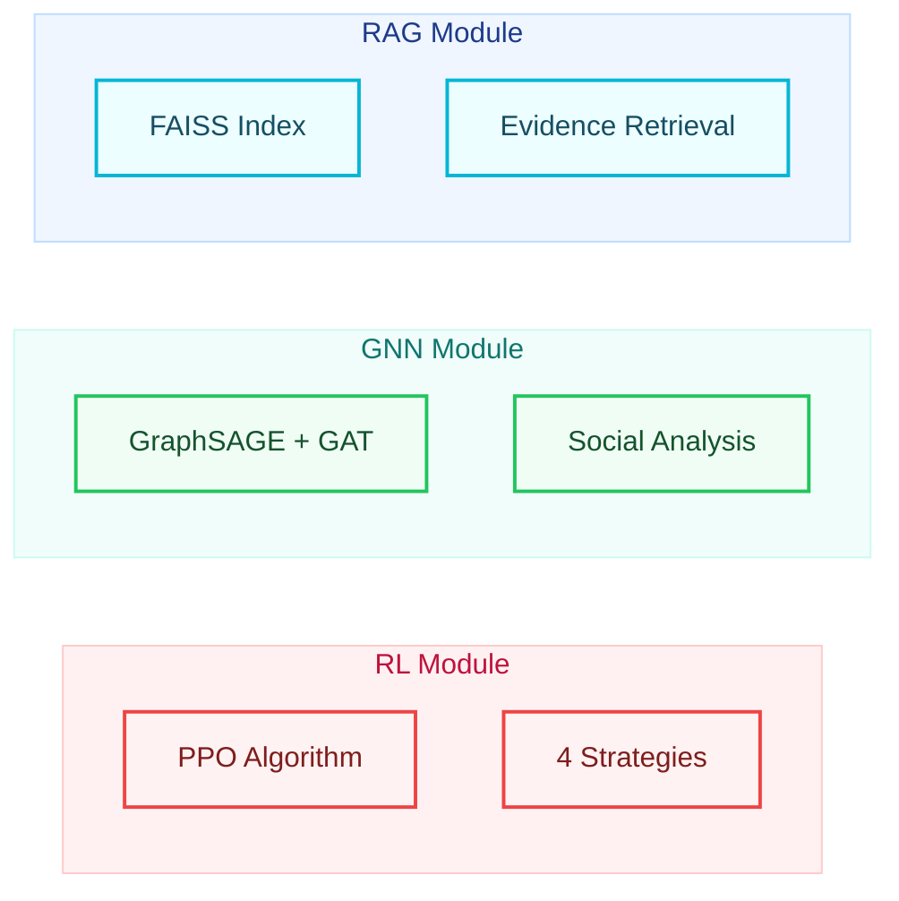
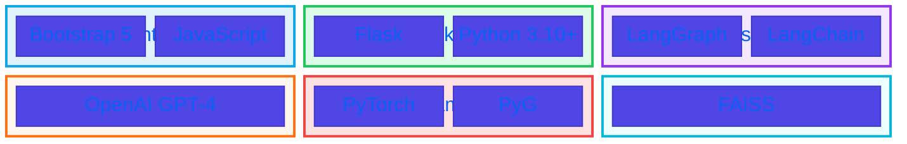
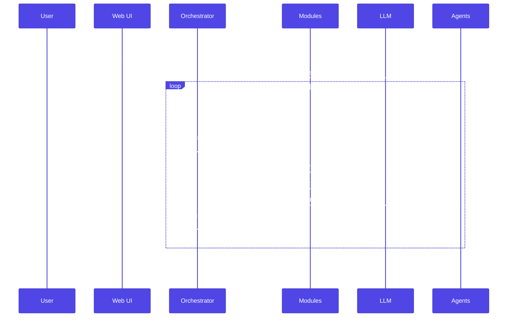

#  System Architecture Overview

*English | [](#)*

---

## High-Level Architecture

Social Debate AI is a multi-agent debate simulation system integrating three AI/ML modules orchestrated by LangGraph:



---

## Component Overview

### 1. Web Interface Layer

| Component | Technology | Description |
|-----------|------------|-------------|
| Frontend | Bootstrap 5 + JavaScript | Responsive UI with real-time updates |
| Backend | Flask | REST API endpoints |
| Communication | AJAX | Async debate control |

### 2. Orchestration Layer

| Component | Purpose |
|-----------|---------|
| **LangGraph Orchestrator** | StateGraph-based workflow engine (v0.2.0+) |
| **Legacy Orchestrator** | Manual async orchestration (fallback) |

See [LangGraph Architecture](LANGGRAPH.md) for details.

### 3. Analysis Modules



| Module | Architecture | Purpose |
|--------|--------------|---------|
| **RAG** | FAISS + OpenAI Embeddings | Evidence retrieval and ranking |
| **GNN** | GraphSAGE + GAT | Predict persuasion success, analyze social influence |
| **RL** | PPO (Actor-Critic) | Dynamic strategy selection |

### 4. Agent Layer

Each agent maintains:
- **Stance** (-1.0 to +1.0): Position on topic
- **Conviction** (0.0 to 1.0): Firmness of belief
- **History**: Persuasion and attack records
- **Surrender State**: Can surrender if persuaded

---

## Technology Stack



| Layer | Technology |
|-------|------------|
| Frontend | Bootstrap 5, JavaScript |
| Backend | Flask, Python 3.10+ |
| Orchestration | LangGraph, LangChain |
| LLM | OpenAI GPT-3.5/4 |
| ML Framework | PyTorch, PyTorch Geometric |
| Vector DB | FAISS |
| Package Manager | uv |

---

## Data Flow



1. User submits debate topic via Web UI
2. Orchestrator initializes agent states
3. For each turn:
   - Run parallel analysis (RL + GNN + RAG)
   - Fuse analysis results
   - Generate response via LLM
   - Evaluate response effects
   - Update agent states
4. Check end conditions (surrender/max rounds)
5. Generate final summary and verdict

---

<a name=""></a>

#  

*[English](#-system-architecture-overview) | *

---

## 

Social Debate AI  Agent  LangGraph  AI/ML 

```mermaid
%%{init: {'theme': 'base', 'themeVariables': { 'primaryColor': '#4f46e5', 'primaryTextColor': '#fff', 'primaryBorderColor': '#4338ca', 'lineColor': '#6366f1', 'secondaryColor': '#10b981', 'tertiaryColor': '#f59e0b'}}}%%
flowchart TB
    %% Styles
    classDef ui fill:#e0f2fe,stroke:#0ea5e9,stroke-width:2px,color:#0c4a6e;
    classDef orch fill:#f3e8ff,stroke:#9333ea,stroke-width:2px,color:#581c87;
    classDef parallel fill:#fff7ed,stroke:#f97316,stroke-width:2px,color:#7c2d12;
    classDef rl fill:#fef2f2,stroke:#ef4444,stroke-width:2px,color:#7f1d1d;
    classDef gnn fill:#f0fdf4,stroke:#22c55e,stroke-width:2px,color:#14532d;
    classDef rag fill:#ecfeff,stroke:#06b6d4,stroke-width:2px,color:#164e63;
    classDef agent fill:#f5f3ff,stroke:#8b5cf6,stroke-width:2px,color:#4c1d95;

    subgraph UI[" Web "]
        direction LR
        F["Flask + Bootstrap 5"]:::ui
    end

    subgraph Orchestrator[" LangGraph "]
        direction TB
        
        subgraph Parallel[""]
            direction LR
            RL[" RL<br/>"]:::rl
            GNN[" GNN<br/>"]:::gnn
            RAG[" RAG<br/>"]:::rag
        end

        Fuse[" "]:::orch
        Gen[" <br/>(LLM)"]:::orch
        Update[" "]:::orch
    end

    subgraph Agents["  Agents"]
        direction LR
        A["Agent A<br/> +0.8"]:::agent
        B["Agent B<br/> -0.6"]:::agent
        C["Agent C<br/> 0.0"]:::agent
    end

    UI --> Orchestrator
    Parallel --> Fuse --> Gen --> Update
    Orchestrator --> Agents
    
    %% Style Subgraphs
    style Parallel fill:#fff7ed,stroke:#fed7aa,color:#9a3412
    style Orchestrator fill:#faf5ff,stroke:#e9d5ff,color:#6b21a8
```

---

## 

### 1. Web 

|  |  |  |
|------|------|------|
|  | Bootstrap 5 + JavaScript |  UI |
|  | Flask | REST API  |
|  | AJAX |  |

### 2. 

|  |  |
|------|------|
| **LangGraph ** |  StateGraph v0.2.0+|
| **** | |

 [LangGraph ](LANGGRAPH.md)

### 3. 

|  |  |  |
|------|------|------|
| **RAG** | FAISS + OpenAI Embeddings |  |
| **GNN** | GraphSAGE + GAT |  |
| **RL** | PPO (Actor-Critic) |  |

### 4. Agent 

 Agent 
- **** (-1.0  +1.0)
- **** (0.0  1.0)
- ****
- ****

---

## 

|  |  |
|------|------|
|  | Bootstrap 5, JavaScript |
|  | Flask, Python 3.10+ |
|  | LangGraph, LangChain |
| LLM | OpenAI GPT-3.5/4 |
| ML  | PyTorch, PyTorch Geometric |
|  | FAISS |
|  | uv |

---

## 

1.  Web UI 
2.  Agent 
3. 
   - RL + GNN + RAG
   - 
   -  LLM 
   - 
   -  Agent 
4. /
5. 
