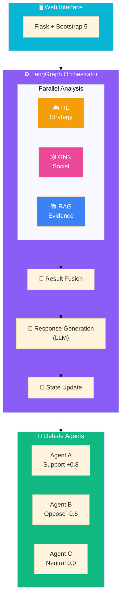
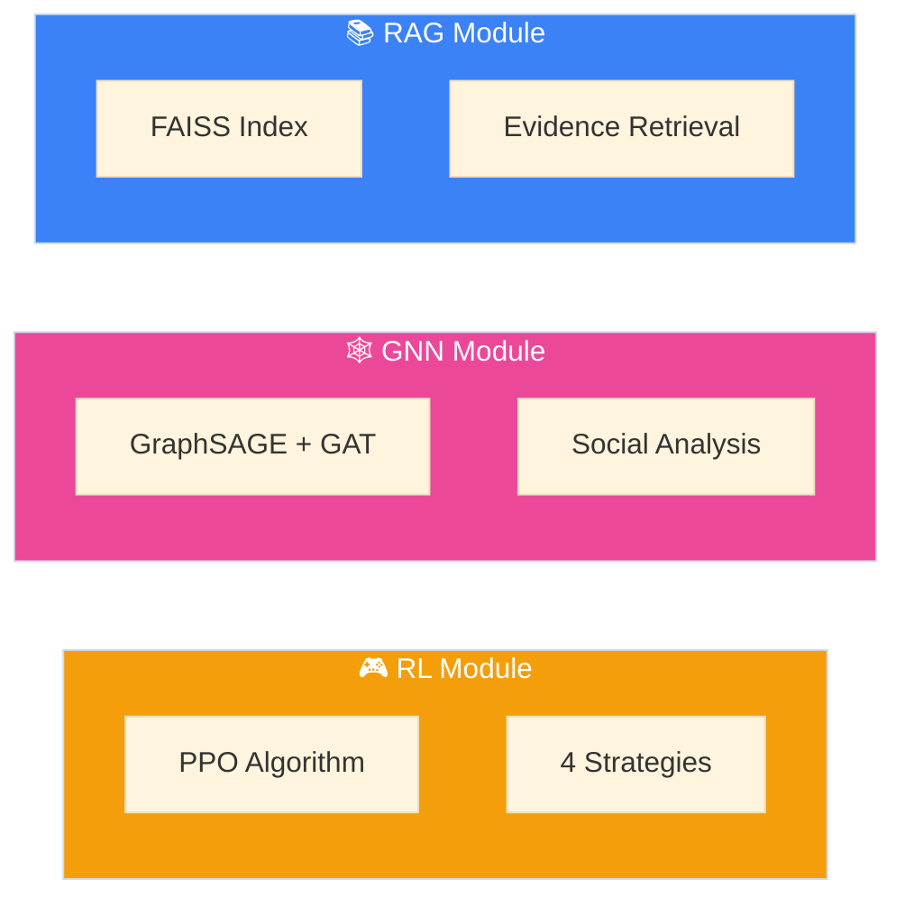
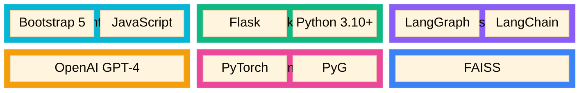
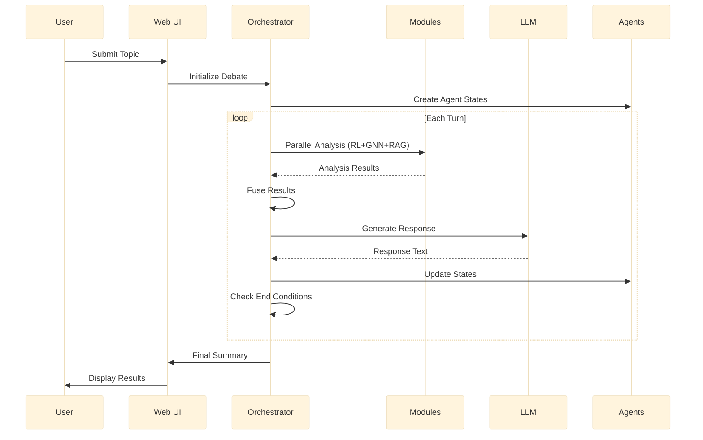
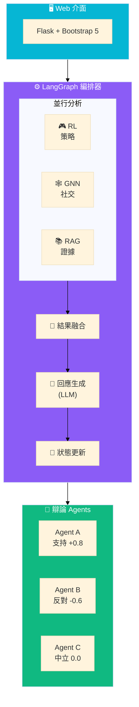

# 🏗️ System Architecture Overview

*English | [中文](#中文版本)*

---

## High-Level Architecture

Social Debate AI is a multi-agent debate simulation system integrating three AI/ML modules orchestrated by LangGraph:

---

## Component Overview

### 1. Web Interface Layer

| Component | Technology | Description |
|-----------|------------|-------------|
| Frontend | Bootstrap 5 + JavaScript | Responsive UI with real-time updates |
| Backend | Flask | REST API endpoints |
| Communication | AJAX | Async debate control |

### 2. Orchestration Layer

| Component | Purpose |
|-----------|---------|
| **LangGraph Orchestrator** | StateGraph-based workflow engine (v0.2.0+) |
| **Legacy Orchestrator** | Manual async orchestration (fallback) |

See [LangGraph Architecture](LANGGRAPH.md) for details.

### 3. Analysis Modules

| Module | Architecture | Purpose |
|--------|--------------|---------|
| **RAG** | FAISS + OpenAI Embeddings | Evidence retrieval and ranking |
| **GNN** | GraphSAGE + GAT | Predict persuasion success, analyze social influence |
| **RL** | PPO (Actor-Critic) | Dynamic strategy selection |

### 4. Agent Layer

Each agent maintains:
- **Stance** (-1.0 to +1.0): Position on topic
- **Conviction** (0.0 to 1.0): Firmness of belief
- **History**: Persuasion and attack records
- **Surrender State**: Can surrender if persuaded

---

## Technology Stack

| Layer | Technology |
|-------|------------|
| Frontend | Bootstrap 5, JavaScript |
| Backend | Flask, Python 3.10+ |
| Orchestration | LangGraph, LangChain |
| LLM | OpenAI GPT-3.5/4 |
| ML Framework | PyTorch, PyTorch Geometric |
| Vector DB | FAISS |
| Package Manager | uv |

---

## Data Flow

1. User submits debate topic via Web UI
2. Orchestrator initializes agent states
3. For each turn:
   - Run parallel analysis (RL + GNN + RAG)
   - Fuse analysis results
   - Generate response via LLM
   - Evaluate response effects
   - Update agent states
4. Check end conditions (surrender/max rounds)
5. Generate final summary and verdict

---

# 🏗️ 系統架構概覽

*[English](#-system-architecture-overview) | 中文*

---

## 高層架構

Social Debate AI 是一個多 Agent 辯論模擬系統，整合三個由 LangGraph 編排的 AI/ML 模組：

---

## 組件概覽

### 1. Web 介面層

| 組件 | 技術 | 說明 |
|------|------|------|
| 前端 | Bootstrap 5 + JavaScript | 響應式 UI，即時更新 |
| 後端 | Flask | REST API 端點 |
| 通訊 | AJAX | 非同步辯論控制 |

### 2. 編排層

| 組件 | 用途 |
|------|------|
| **LangGraph 編排器** | 基於 StateGraph 的工作流引擎（v0.2.0+）|
| **舊版編排器** | 手動異步編排（備用）|

詳見 [LangGraph 架構](LANGGRAPH.md)。

### 3. 分析模組

| 模組 | 架構 | 用途 |
|------|------|------|
| **RAG** | FAISS + OpenAI Embeddings | 證據檢索和排序 |
| **GNN** | GraphSAGE + GAT | 預測說服成功率，分析社交影響 |
| **RL** | PPO (Actor-Critic) | 動態策略選擇 |

### 4. Agent 層

每個 Agent 維護：
- **立場** (-1.0 到 +1.0)：對主題的立場
- **信念** (0.0 到 1.0)：信念堅定度
- **歷史**：說服和攻擊記錄
- **投降狀態**：被說服時可投降

---

## 技術棧

| 層級 | 技術 |
|------|------|
| 前端 | Bootstrap 5, JavaScript |
| 後端 | Flask, Python 3.10+ |
| 編排 | LangGraph, LangChain |
| LLM | OpenAI GPT-3.5/4 |
| ML 框架 | PyTorch, PyTorch Geometric |
| 向量資料庫 | FAISS |
| 套件管理器 | uv |

---

## 資料流

1. 用戶通過 Web UI 提交辯論主題
2. 編排器初始化 Agent 狀態
3. 每個回合：
   - 執行並行分析（RL + GNN + RAG）
   - 融合分析結果
   - 通過 LLM 生成回應
   - 評估回應效果
   - 更新 Agent 狀態
4. 檢查結束條件（投降/最大回合數）
5. 生成最終摘要和判決
