#  GNN Module Quick Reference

*English | [](#)*

>  **For detailed explanation, see [LEARNING_NOTE §2: GNN Deep Dive](../LEARNING_NOTE.md#part-2-gnn-deep-dive-)**

---

## Overview

The GNN (Graph Neural Network) module analyzes social dynamics in debates using **GraphSAGE** and **GAT** architectures.

```mermaid
%%{init: {'theme': 'base', 'themeVariables': { 'primaryColor': '#4f46e5', 'primaryTextColor': '#fff', 'primaryBorderColor': '#4338ca', 'lineColor': '#6366f1', 'secondaryColor': '#10b981', 'tertiaryColor': '#f59e0b'}}}%%
flowchart LR
    %% Styles
    classDef input fill:#e0f2fe,stroke:#0ea5e9,stroke-width:2px,color:#0c4a6e;
    classDef model fill:#f3e8ff,stroke:#9333ea,stroke-width:2px,color:#581c87;
    classDef output fill:#dcfce7,stroke:#22c55e,stroke-width:2px,color:#14532d;

    subgraph Input[" Input"]
        T["Text (768-dim BERT)"]:::input
        G["Graph Structure"]:::input
    end

    subgraph GNN[" GNN Encoder"]
        S1["GraphSAGE ×3"]:::model
        S2["GAT (4 heads)"]:::model
    end

    subgraph Output[" Multi-Task Output"]
        D["Delta Prediction"]:::output
        Q["Quality Score"]:::output
        S["Strategy Classification"]:::output
    end

    Input --> GNN --> Output
```



---

## API Reference

### `PersuasionGNN`

```python
from src.gnn.social_encoder import PersuasionGNN

model = PersuasionGNN(
    input_dim=768,      # BERT embedding dimension
    hidden_dim=256,     # Hidden layer dimension
    num_strategies=4    # Number of strategies
)
```

### `predict_persuasion()`

```python
result = model.predict_persuasion(text_features, agent_id)

# Returns:
{
    'delta_probability': 0.73,     # Persuasion success rate
    'quality_score': 0.65,         # Response quality
    'best_strategy': 'analytical', # Recommended strategy
    'strategy_scores': {...}       # All strategy probabilities
}
```

### `gnn_analyze_social()` (LangGraph Tool)

```python
from src.orchestrator.debate_tools import gnn_analyze_social

result = gnn_analyze_social.invoke({
    "agent_id": "Agent_A",
    "current_stance": 0.8,
    "conviction": 0.7,
    "persuasion_history": [0.5, 0.6, 0.7]
})
```

---

## Architecture Summary

| Layer | Dimensions | Purpose |
|-------|------------|---------|
| SAGEConv 1 | 768 → 256 | Initial feature compression |
| SAGEConv 2 | 256 → 256 | Neighbor aggregation |
| SAGEConv 3 | 256 → 128 | Further compression |
| GATConv | 128 → 128 (4 heads) | Attention-weighted aggregation |
| Delta Head | 128 → 1 | Persuasion prediction |
| Quality Head | 128 → 1 | Quality regression |
| Strategy Head | 128 → 4 | Strategy classification |

---

## Configuration

`configs/gnn.yaml`:

```yaml
model:
  input_dim: 768
  hidden_dim: 256
  num_strategies: 4
  dropout: 0.3
  attention_heads: 4

training:
  epochs: 50
  learning_rate: 0.001
  batch_size: 32
```

---

## Key Files

| File | Description |
|------|-------------|
| `src/gnn/social_encoder.py` | Model definition and inference |
| `src/gnn/train_supervised.py` | Training script |

---

<a name=""></a>

#  GNN 

*[English](#-gnn-module-quick-reference) | *

>  ** [LEARNING_NOTE §2: GNN ](../LEARNING_NOTE.md#part-2-gnn-deep-dive-)**

---

## 

GNN **GraphSAGE**  **GAT** 

---

## API 

### `PersuasionGNN`

```python
from src.gnn.social_encoder import PersuasionGNN

model = PersuasionGNN(
    input_dim=768,      # BERT 
    hidden_dim=256,     # 
    num_strategies=4    # 
)
```

### `predict_persuasion()`

```python
result = model.predict_persuasion(text_features, agent_id)

# :
{
    'delta_probability': 0.73,     # 
    'quality_score': 0.65,         # 
    'best_strategy': 'analytical', # 
    'strategy_scores': {...}       # 
}
```

---

## 

|  |  |  |
|------|------|------|
| SAGEConv 1 | 768 → 256 |  |
| SAGEConv 2 | 256 → 256 |  |
| SAGEConv 3 | 256 → 128 |  |
| GATConv | 128 → 128 (4 ) |  |
| Delta Head | 128 → 1 |  |
| Quality Head | 128 → 1 |  |
| Strategy Head | 128 → 4 |  |

---

## 

`configs/gnn.yaml`:

```yaml
model:
  input_dim: 768
  hidden_dim: 256
  num_strategies: 4
  dropout: 0.3
  attention_heads: 4

training:
  epochs: 50
  learning_rate: 0.001
  batch_size: 32
```

---

## 

|  |  |
|------|------|
| `src/gnn/social_encoder.py` |  |
| `src/gnn/train_supervised.py` |  |
