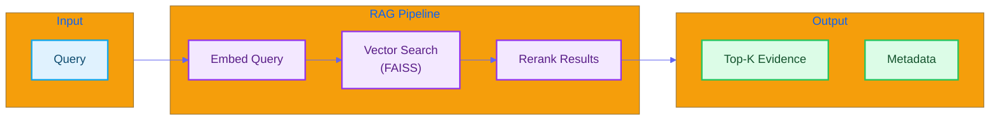

#  RAG Module Quick Reference

*English | [](#)*

>  **For detailed explanation, see [LEARNING_NOTE §4.1: RAG Principles](../LEARNING_NOTE.md#41-rag-principles-and-implementation)**

---

## Overview

The RAG (Retrieval-Augmented Generation) module retrieves relevant evidence to support debate arguments using **FAISS** vector search and **OpenAI embeddings**.



---

## API Reference

### `SimpleRetriever`

```python
from src.rag.simple_retriever import SimpleRetriever

retriever = SimpleRetriever()
results = retriever.retrieve(query="AI regulation", top_k=5)

# Returns list of RetrievalResult:
# [
#     RetrievalResult(text="...", score=0.92, metadata={...}),
#     ...
# ]
```

### `EnhancedRetriever`

```python
from src.rag.retriever import EnhancedRetriever

retriever = EnhancedRetriever()
results = retriever.retrieve(
    query="AI regulation success cases",
    k=5,
    filter={'topic': 'technology'}
)
```

### `rag_retrieve_evidence()` (LangGraph Tool)

```python
from src.orchestrator.debate_tools import rag_retrieve_evidence

result = rag_retrieve_evidence.invoke({
    "query": "Evidence for AI regulation",
    "topic": "AI Ethics",
    "top_k": 8
})

# Returns:
{
    'evidence_pool': [...],      # List of evidence items
    'best_evidence': "...",      # Top evidence text
    'evidence_types': {...},     # Type distribution
    'total_evidence': 8
}
```

---

## Architecture

| Component | Technology | Purpose |
|-----------|------------|---------|
| Embedding | OpenAI `text-embedding-3-small` | Text vectorization |
| Vector DB | FAISS | Fast similarity search |
| Storage | Chroma (optional) | Persistent storage |
| Reranking | Cross-encoder (optional) | Result refinement |

---

## Configuration

`configs/rag.yaml`:

```yaml
embedding:
  model: "text-embedding-3-small"
  dimension: 1536

retrieval:
  top_k: 10
  similarity_threshold: 0.5
  
index:
  type: "faiss"
  metric: "cosine"

chunking:
  chunk_size: 512
  overlap: 128
```

---

## Key Files

| File | Description |
|------|-------------|
| `src/rag/retriever.py` | Enhanced retriever with reranking |
| `src/rag/simple_retriever.py` | Lightweight retriever |
| `src/rag/build_index.py` | Index building script |

---

<a name=""></a>

#  RAG 

*[English](#-rag-module-quick-reference) | *

>  ** [LEARNING_NOTE §4.1: RAG ](../LEARNING_NOTE.md#41-rag-principles-and-implementation)**

---

## 

RAG **FAISS**  **OpenAI ** 

---

## API 

### `SimpleRetriever`

```python
from src.rag.simple_retriever import SimpleRetriever

retriever = SimpleRetriever()
results = retriever.retrieve(query="AI ", top_k=5)

#  RetrievalResult :
# [
#     RetrievalResult(text="...", score=0.92, metadata={...}),
#     ...
# ]
```

### `rag_retrieve_evidence()` (LangGraph )

```python
from src.orchestrator.debate_tools import rag_retrieve_evidence

result = rag_retrieve_evidence.invoke({
    "query": "AI ",
    "topic": "AI ",
    "top_k": 8
})

# :
{
    'evidence_pool': [...],      # 
    'best_evidence': "...",      # 
    'evidence_types': {...},     # 
    'total_evidence': 8
}
```

---

## 

|  |  |  |
|------|------|------|
|  | OpenAI `text-embedding-3-small` |  |
|  | FAISS |  |
|  | Chroma|  |
|  | Cross-encoder|  |

---

## 

`configs/rag.yaml`:

```yaml
embedding:
  model: "text-embedding-3-small"
  dimension: 1536

retrieval:
  top_k: 10
  similarity_threshold: 0.5
  
index:
  type: "faiss"
  metric: "cosine"

chunking:
  chunk_size: 512
  overlap: 128
```

---

## 

|  |  |
|------|------|
| `src/rag/retriever.py` |  |
| `src/rag/simple_retriever.py` |  |
| `src/rag/build_index.py` |  |
