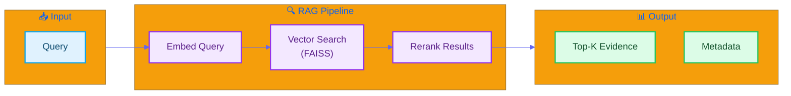

# 📚 RAG Module Quick Reference

*English | [中文](#中文版本)*

> 📚 **For detailed explanation, see [LEARNING_NOTE §4.1: RAG Principles](../LEARNING_NOTE.md#41-rag-principles-and-implementation)**

---

## Overview

The RAG (Retrieval-Augmented Generation) module retrieves relevant evidence to support debate arguments using **FAISS** vector search and **OpenAI embeddings**.



---

## API Reference

### `SimpleRetriever`

```python
from src.rag.simple_retriever import SimpleRetriever

retriever = SimpleRetriever()
results = retriever.retrieve(query="AI regulation", top_k=5)

# Returns list of RetrievalResult:
# [
#     RetrievalResult(text="...", score=0.92, metadata={...}),
#     ...
# ]
```

### `EnhancedRetriever`

```python
from src.rag.retriever import EnhancedRetriever

retriever = EnhancedRetriever()
results = retriever.retrieve(
    query="AI regulation success cases",
    k=5,
    filter={'topic': 'technology'}
)
```

### `rag_retrieve_evidence()` (LangGraph Tool)

```python
from src.orchestrator.debate_tools import rag_retrieve_evidence

result = rag_retrieve_evidence.invoke({
    "query": "Evidence for AI regulation",
    "topic": "AI Ethics",
    "top_k": 8
})

# Returns:
{
    'evidence_pool': [...],      # List of evidence items
    'best_evidence': "...",      # Top evidence text
    'evidence_types': {...},     # Type distribution
    'total_evidence': 8
}
```

---

## Architecture

| Component | Technology | Purpose |
|-----------|------------|---------|
| Embedding | OpenAI `text-embedding-3-small` | Text vectorization |
| Vector DB | FAISS | Fast similarity search |
| Storage | Chroma (optional) | Persistent storage |
| Reranking | Cross-encoder (optional) | Result refinement |

---

## Configuration

`configs/rag.yaml`:

```yaml
embedding:
  model: "text-embedding-3-small"
  dimension: 1536

retrieval:
  top_k: 10
  similarity_threshold: 0.5
  
index:
  type: "faiss"
  metric: "cosine"

chunking:
  chunk_size: 512
  overlap: 128
```

---

## Key Files

| File | Description |
|------|-------------|
| `src/rag/retriever.py` | Enhanced retriever with reranking |
| `src/rag/simple_retriever.py` | Lightweight retriever |
| `src/rag/build_index.py` | Index building script |

---

<a name="中文版本"></a>

# 📚 RAG 模組快速參考

*[English](#-rag-module-quick-reference) | 中文*

> 📚 **詳細說明請見 [LEARNING_NOTE §4.1: RAG 原理](../LEARNING_NOTE.md#41-rag-principles-and-implementation)**

---

## 概述

RAG（檢索增強生成）模組使用 **FAISS** 向量搜索和 **OpenAI 嵌入** 來檢索支持辯論論點的相關證據。

---

## API 參考

### `SimpleRetriever`

```python
from src.rag.simple_retriever import SimpleRetriever

retriever = SimpleRetriever()
results = retriever.retrieve(query="AI 監管", top_k=5)

# 返回 RetrievalResult 列表:
# [
#     RetrievalResult(text="...", score=0.92, metadata={...}),
#     ...
# ]
```

### `rag_retrieve_evidence()` (LangGraph 工具)

```python
from src.orchestrator.debate_tools import rag_retrieve_evidence

result = rag_retrieve_evidence.invoke({
    "query": "AI 監管的證據",
    "topic": "AI 倫理",
    "top_k": 8
})

# 返回:
{
    'evidence_pool': [...],      # 證據列表
    'best_evidence': "...",      # 最佳證據文本
    'evidence_types': {...},     # 類型分布
    'total_evidence': 8
}
```

---

## 架構

| 組件 | 技術 | 用途 |
|------|------|------|
| 嵌入 | OpenAI `text-embedding-3-small` | 文本向量化 |
| 向量資料庫 | FAISS | 快速相似度搜索 |
| 存儲 | Chroma（可選）| 持久化存儲 |
| 重排序 | Cross-encoder（可選）| 結果優化 |

---

## 配置

`configs/rag.yaml`:

```yaml
embedding:
  model: "text-embedding-3-small"
  dimension: 1536

retrieval:
  top_k: 10
  similarity_threshold: 0.5
  
index:
  type: "faiss"
  metric: "cosine"

chunking:
  chunk_size: 512
  overlap: 128
```

---

## 關鍵文件

| 文件 | 說明 |
|------|------|
| `src/rag/retriever.py` | 帶重排序的增強檢索器 |
| `src/rag/simple_retriever.py` | 輕量級檢索器 |
| `src/rag/build_index.py` | 索引建置腳本 |
