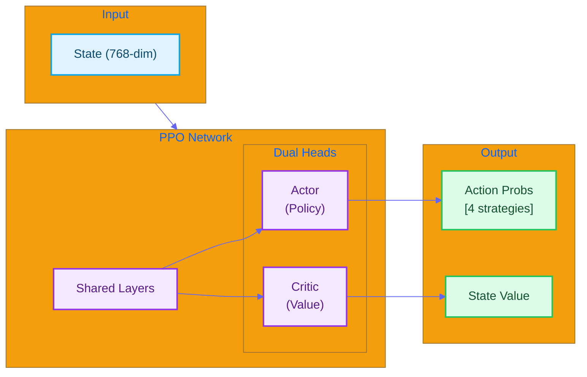

#  RL Module Quick Reference

*English | [](#)*

>  **For detailed explanation, see [LEARNING_NOTE §3: PPO Deep Dive](../LEARNING_NOTE.md#part-3-ppo-deep-dive-)**

---

## Overview

The RL (Reinforcement Learning) module uses **PPO (Proximal Policy Optimization)** algorithm with an **Actor-Critic** architecture to select optimal debate strategies.



---

## API Reference

### `PPONetwork`

```python
from src.rl.ppo_trainer import PPONetwork

network = PPONetwork(
    state_dim=768,     # State dimension
    action_dim=4,      # Number of strategies
    hidden_dim=256     # Hidden layer dimension
)
```

### `select_action()`

```python
action, log_prob, value = network.select_action(state_tensor)

# action: 0=aggressive, 1=defensive, 2=analytical, 3=empathetic
```

### `rl_select_strategy()` (LangGraph Tool)

```python
from src.orchestrator.debate_tools import rl_select_strategy

result = rl_select_strategy.invoke({
    "context": "Topic: AI regulation...",
    "social_context": [0.1, -0.2, ...]  # 128-dim
})

# Returns:
{
    'strategy': 'analytical',
    'quality_score': 0.75,
    'confidence': 0.8
}
```

---

## Strategies

| ID | Strategy | Description | Best When |
|----|----------|-------------|-----------|
| 0 | `aggressive` | Challenge opponent directly | Opponent has weak arguments |
| 1 | `defensive` | Strengthen own position | Under strong attack |
| 2 | `analytical` | Use logic and evidence | Building credibility |
| 3 | `empathetic` | Find common ground | Seeking consensus |

---

## Architecture Summary

| Component | Dimensions | Purpose |
|-----------|------------|---------|
| Shared Layer 1 | 768 → 256 | Feature extraction |
| Shared Layer 2 | 256 → 256 | Representation learning |
| Actor Head | 256 → 128 → 4 | Policy (action probabilities) |
| Critic Head | 256 → 128 → 1 | Value (state estimation) |

---

## Configuration

`configs/rl.yaml`:

```yaml
ppo:
  gamma: 0.99           # Discount factor
  gae_lambda: 0.95      # GAE parameter
  epsilon: 0.2          # Clipping parameter
  update_epochs: 4      # PPO update epochs
  
network:
  state_dim: 768
  action_dim: 4
  hidden_dim: 256
  
training:
  learning_rate: 0.0003
  batch_size: 64
```

---

## Key Files

| File | Description |
|------|-------------|
| `src/rl/policy_network.py` | Policy network for inference |
| `src/rl/ppo_trainer.py` | PPO trainer and environment |
| `src/rl/train_ppo.py` | Training script |

---

<a name=""></a>

#  RL 

*[English](#-rl-module-quick-reference) | *

>  ** [LEARNING_NOTE §3: PPO ](../LEARNING_NOTE.md#part-3-ppo-deep-dive-)**

---

## 

RL **PPO**  **Actor-Critic** 

---

## API 

### `PPONetwork`

```python
from src.rl.ppo_trainer import PPONetwork

network = PPONetwork(
    state_dim=768,     # 
    action_dim=4,      # 
    hidden_dim=256     # 
)
```

### `select_action()`

```python
action, log_prob, value = network.select_action(state_tensor)

# action: 0=, 1=, 2=, 3=
```

---

## 

| ID |  |  |  |
|----|------|------|----------|
| 0 | `aggressive` |  |  |
| 1 | `defensive` |  |  |
| 2 | `analytical` |  |  |
| 3 | `empathetic` |  |  |

---

## 

|  |  |  |
|------|------|------|
|  1 | 768 → 256 |  |
|  2 | 256 → 256 |  |
| Actor Head | 256 → 128 → 4 | |
| Critic Head | 256 → 128 → 1 | |

---

## 

`configs/rl.yaml`:

```yaml
ppo:
  gamma: 0.99           # 
  gae_lambda: 0.95      # GAE 
  epsilon: 0.2          # 
  update_epochs: 4      # PPO 
  
network:
  state_dim: 768
  action_dim: 4
  hidden_dim: 256
```

---

## 

|  |  |
|------|------|
| `src/rl/policy_network.py` |  |
| `src/rl/ppo_trainer.py` | PPO  |
| `src/rl/train_ppo.py` |  |
